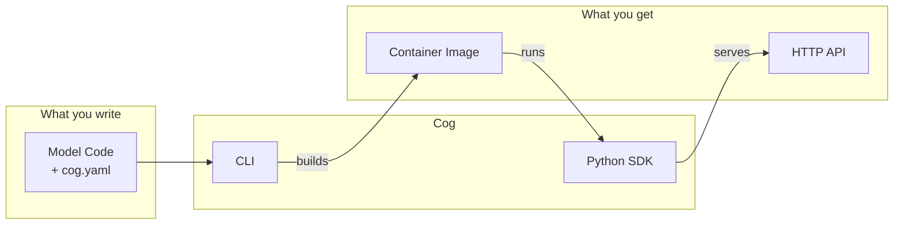
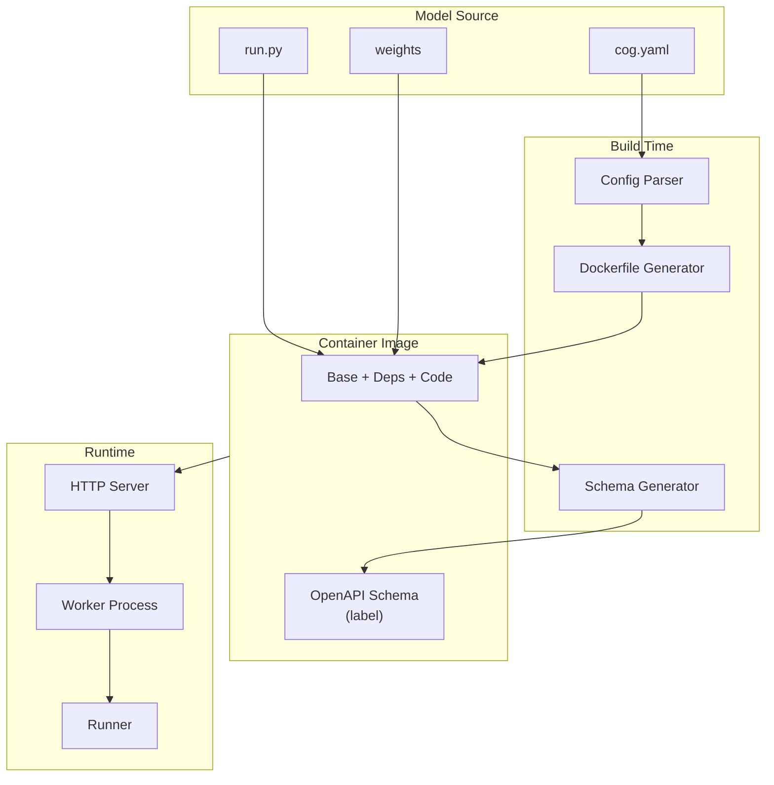

# Cog Architecture Overview

Cog packages machine learning models into production-ready OCI images.

## The Big Picture

## Components

### Model Source

What the model author provides: `cog.yaml` for environment config, a Runner class with `setup()` and `run()` methods, and optionally model weights.

**Deep dive**: [Model Source](./01-model-source.md)

---

### Schema

An OpenAPI specification generated from the runner's type hints. Describes what inputs the model accepts and what outputs it produces.

**Deep dive**: [Schema](./02-schema.md)

---

### Prediction API

The HTTP interface for running predictions. A fixed envelope format (`PredictionRequest`/`PredictionResponse`) wraps model-specific inputs and outputs.

**Deep dives**:
- [Legacy API](./legacy/03-prediction-api.md) - FastAPI implementation details
- [FFI API](./ffi/03-prediction-api.md) - Rust/Axum implementation details

---

### Container Runtime

The runtime that runs inside the container: an HTTP server, worker process isolation, and prediction execution. Cog has two runtime implementations:

- **Legacy (Python/FastAPI)**: Current default implementation - [Documentation](./legacy/)
- **FFI (Rust/PyO3)**: Next-generation experimental implementation - [Documentation](./ffi/)

**Deep dives**:
- [Legacy Runtime](./legacy/04-container-runtime.md) - FastAPI/Uvicorn two-process architecture
- [FFI Runtime](./ffi/04-container-runtime.md) - Rust/Axum with PyO3 FFI bridge

---

### Build System

Transforms `cog.yaml` and user code into a Docker image with the right Python version, CUDA libraries, and dependencies.

**Deep dive**: [Build System](./05-build-system.md)

---

### CLI

The command-line tool for building, testing, and deploying models.

**Deep dive**: [CLI](./06-cli.md)

---

## How It Fits Together

## Terminology

| Term | Meaning |
|------|---------|
| **Runner** | User's model class with `setup()` and `run()` methods |
| **Schema** | OpenAPI spec describing the model's input/output interface |
| **Envelope** | Fixed request/response structure wrapping model-specific data |
| **Worker** | Isolated subprocess running user code |
| **Setup** | One-time model initialization at container start |

## Runtime Implementations

Cog supports two runtime implementations:

### Legacy Runtime (Python/FastAPI)
- **Status**: Current default
- **Use when**: Running standard Cog containers
- **Implementation**: `python/cog/server/`
- **Documentation**: [legacy/](./legacy/)

### FFI Runtime (Rust/PyO3)
- **Status**: Experimental (in development)
- **Use when**: Set `USE_COGLET` environment variable
- **Implementation**: `crates/coglet/`
- **Documentation**: [ffi/](./ffi/)
- **Benefits**: Better performance, stability, and resource management

Both runtimes expose the same HTTP API and support the same model code. The FFI runtime is a drop-in replacement with improved internals.

## Reading Order

For understanding Cog's architecture, we recommend reading in this order:

1. [Model Source](./01-model-source.md) - What users write
2. [Schema](./02-schema.md) - How the interface is described
3. **Choose a runtime path**:
   - **Legacy**: [Prediction API](./legacy/03-prediction-api.md) → [Container Runtime](./legacy/04-container-runtime.md)
   - **FFI**: [Prediction API](./ffi/03-prediction-api.md) → [Container Runtime](./ffi/04-container-runtime.md)
4. [Build System](./05-build-system.md) - How images are built
5. [CLI](./06-cli.md) - How users interact with it all
