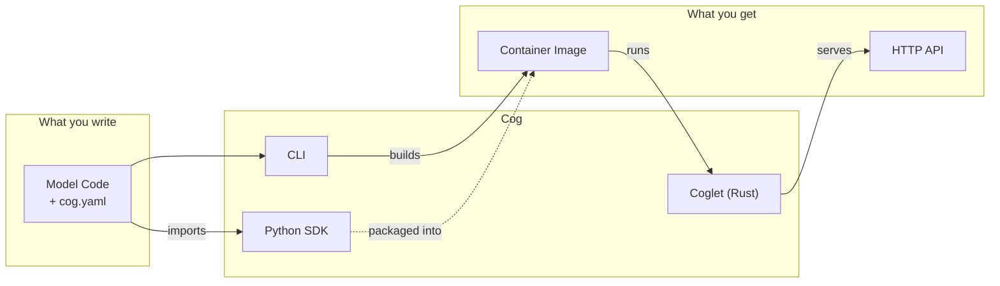
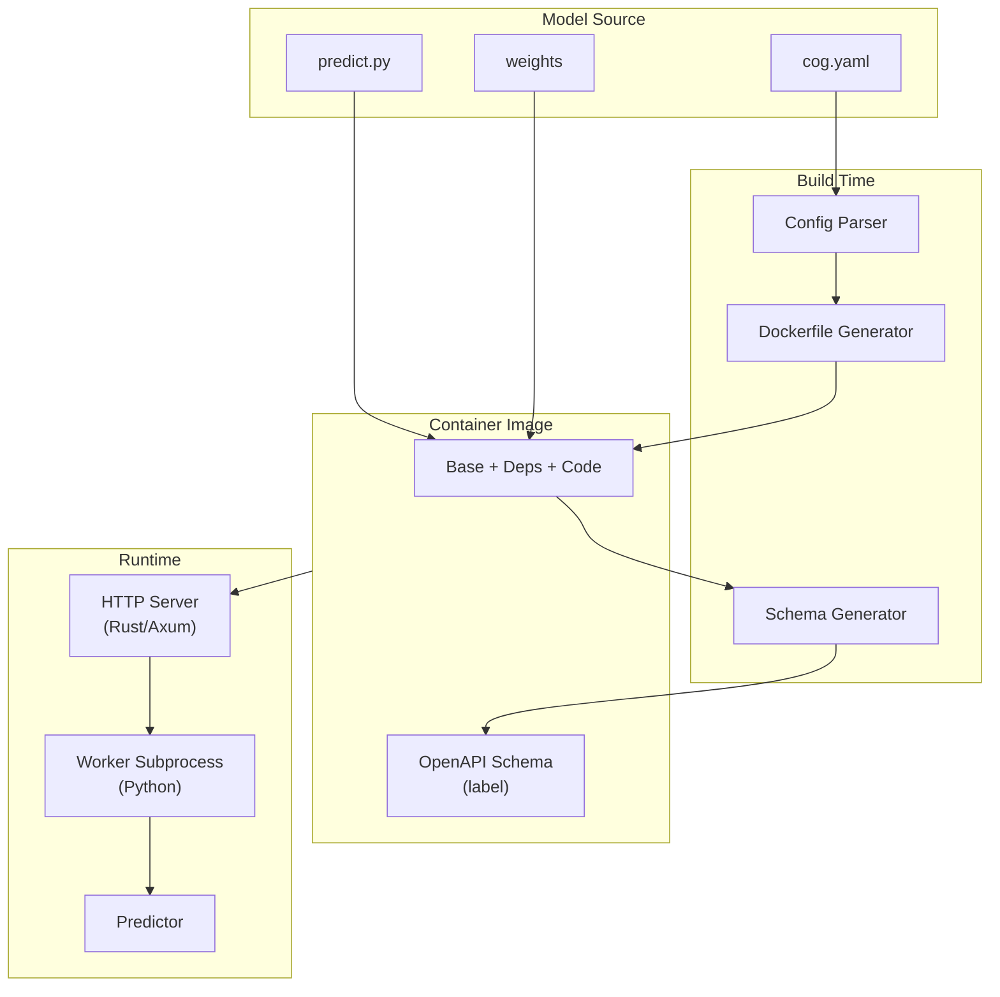

# Cog Architecture Overview

Cog packages machine learning models into production-ready OCI images.

## The Big Picture

```mermaid
flowchart LR
    subgraph input["What you write"]
        model["Model Code<br/>+ cog.yaml"]
    end
    
    subgraph cog["Cog"]
        cli["CLI"]
        sdk["Python SDK"]
        coglet["Coglet (Rust)"]
    end
    
    subgraph output["What you get"]
        image["Container Image"]
        api["HTTP API"]
    end
    
    model -->|"imports"| sdk
    model --> cli
    cli -->|"builds"| image
    sdk -.->|"packaged into"| image
    image -->|"runs"| coglet
    coglet -->|"serves"| api
```

## Components

### Model Source

What the model author provides: `cog.yaml` for environment config, a Predictor class with `setup()` and `predict()` methods, and optionally model weights.

**Deep dive**: [Model Source](./01-model-source.md)

---

### Python SDK

The `cog` Python package that model authors import. Provides `BasePredictor`, the type system (`Input`, `Path`, `Secret`, `ConcatenateIterator`), and the thin server entry point that launches coglet. Installed inside every Cog container as a wheel.

**Deep dive**: [Model Source](./01-model-source.md) (covers the SDK's public API)

---

### Schema

An OpenAPI specification generated from the predictor's type hints. Describes what inputs the model accepts and what outputs it produces.

**Deep dive**: [Schema](./02-schema.md)

---

### Prediction API

The HTTP interface for running predictions. A fixed envelope format (`PredictionRequest`/`PredictionResponse`) wraps model-specific inputs and outputs.

**Deep dive**: [Prediction API](./03-prediction-api.md)

---

### Container Runtime

The runtime that runs inside the container: a Rust HTTP server (Axum), worker process isolation via subprocess, and prediction execution via PyO3 bindings.

**Deep dive**: [Container Runtime](./04-container-runtime.md)

---

### Build System

Transforms `cog.yaml` and user code into a Docker image with the right Python version, CUDA libraries, and dependencies.

**Deep dive**: [Build System](./05-build-system.md)

---

### CLI

The command-line tool for building, testing, and deploying models.

**Deep dive**: [CLI](./06-cli.md)

---

## How It Fits Together

```mermaid
flowchart TB
    subgraph source["Model Source"]
        yaml["cog.yaml"]
        code["predict.py"]
        weights["weights"]
    end
    
    subgraph build["Build Time"]
        config["Config Parser"]
        generator["Dockerfile Generator"]
        schema_gen["Schema Generator"]
    end
    
    subgraph image["Container Image"]
        layers["Base + Deps + Code"]
        schema["OpenAPI Schema<br/>(label)"]
    end
    
    subgraph runtime["Runtime"]
        server["HTTP Server<br/>(Rust/Axum)"]
        worker["Worker Subprocess<br/>(Python)"]
        predictor["Predictor"]
    end
    
    yaml --> config
    config --> generator
    generator --> layers
    code --> layers
    weights --> layers
    
    layers --> schema_gen
    schema_gen --> schema
    
    image --> server
    server --> worker
    worker --> predictor
```

## Terminology

| Term | Meaning |
|------|---------|
| **SDK** | The `cog` Python package -- the framework users build models on |
| **Predictor** | User's model class with `setup()` and `predict()` methods |
| **Schema** | OpenAPI spec describing the model's input/output interface |
| **Envelope** | Fixed request/response structure wrapping model-specific data |
| **Worker** | Isolated subprocess running user code |
| **Setup** | One-time model initialization at container start |
| **Coglet** | Rust-based prediction server that runs inside containers |
| **Slot** | A concurrency unit -- one Unix socket connection to the worker subprocess |

## Reading Order

For understanding Cog's architecture, we recommend reading in this order:

1. [Model Source](./01-model-source.md) -- What users write
2. [Schema](./02-schema.md) -- How the interface is described
3. [Prediction API](./03-prediction-api.md) -- The HTTP contract
4. [Container Runtime](./04-container-runtime.md) -- What runs inside the container
5. [Build System](./05-build-system.md) -- How images are built
6. [CLI](./06-cli.md) -- How users interact with it all
