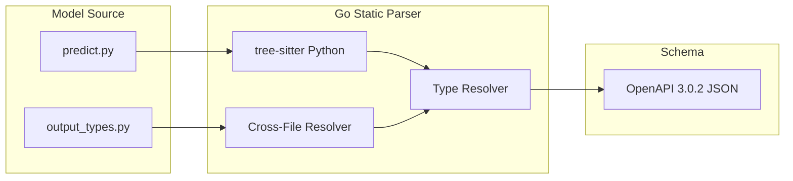

# Schema

The schema is an **OpenAPI 3.0.2 specification** that describes a model's interface. It's the contract between the model and everything that interacts with it.

## Why the Schema Exists

Every Cog model uses the same [Prediction API](./ffi/03-prediction-api.md) envelope format, but the `input` and `output` fields are model-specific. The schema captures what each model expects and produces.

```
┌─────────────────────────────────────────────────┐
│  PredictionRequest (fixed envelope)             │
│  ┌─────────────────────────────────────────┐    │
│  │  "input": { ... }  ��� model-specific     │    │
│  └─────────────────────────────────────────┘    │
└─────────────────────────────────────────────────┘
                      ↑
            Schema defines this part
```

Without the schema, consumers would have no way to know:
- What inputs the model accepts
- What types those inputs should be
- What constraints apply (required fields, min/max values, allowed choices)
- What the output looks like

### How It's Used Today

| Consumer | What They Use the Schema For |
|----------|------------------------------|
| **Replicate platform** | Generate input forms in the web UI, validate requests before routing to models |
| **HTTP server (coglet)** | Validate incoming JSON, reject malformed requests before they reach user code |
| **CLI (`cog predict`)** | Parse `-i key=value` flags into correctly-typed Python objects |
| **Docker label** | Extract model interface without running the container |
| **API clients** | Know what to send and what to expect back without reading source code |

## How It's Generated

Schema generation is **fully static** — it parses Python source code at `cog build` time using [tree-sitter](https://tree-sitter.github.io/tree-sitter/) in Go. No Python runtime is invoked. This makes schema generation deterministic, fast, and independent of the model's dependencies.



### Pipeline Steps

1. **Parse** the predictor file with tree-sitter (concrete syntax tree, not AST)
2. **Collect imports** — track where each name came from (`from cog import Path`, `from pydantic import BaseModel`)
3. **Collect module scope** — resolve module-level variable assignments (for default values, choices lists)
4. **Collect BaseModel subclasses** — find all classes that inherit from `BaseModel` (cog or pydantic) in the current file
5. **Resolve cross-file models** — for imported names not found locally, find the `.py` file on disk, parse it, and extract its BaseModel definitions
6. **Extract inputs** — walk the `predict()` / `train()` method parameters, resolve types, defaults, and `Input()` metadata
7. **Resolve output type** — recursively resolve the return type annotation into a `SchemaType`
8. **Generate OpenAPI** — convert the extracted `PredictorInfo` into a full OpenAPI 3.0.2 JSON document

### Cross-File Resolution

When a predictor imports types from other project files, the schema generator resolves them automatically:

```python
# output_types.py
from pydantic import BaseModel

class Prediction(BaseModel):
    text: str
    score: float
    tags: list[str]
```

```python
# predict.py
from cog import BasePredictor
from output_types import Prediction

class Predictor(BasePredictor):
    def predict(self, prompt: str) -> Prediction:
        ...
```

The resolver handles every permutation of local imports:

| Import Style | File Resolved |
|-------------|---------------|
| `from output_types import X` | `<project>/output_types.py` |
| `from .output_types import X` | `<project>/output_types.py` |
| `from models.output import X` | `<project>/models/output.py` |
| `from .models.output import X` | `<project>/models/output.py` |
| `from output_types import X as Y` | `<project>/output_types.py` (alias tracked) |

**How it distinguishes local from external**: the resolver converts the module path to a filesystem path and checks if the file exists. If `output_types.py` exists in the project directory, it's local. If not (e.g., `from transformers import ...`), it's external. Known external packages (stdlib, torch, numpy, etc.) are skipped without a filesystem check.

**Error messages**: when a type can't be resolved, the error includes the import source:
```
cannot resolve output type 'WeirdType' (imported from 'some_package') —
external types cannot be statically analyzed. Define it as a BaseModel
subclass in your predict file, or provide a .pyi stub
```

## SchemaType: The Type System

Output types are represented as a recursive algebraic data type (`SchemaType`) that composes arbitrarily:

```
SchemaType
├── SchemaPrimitive   — str, int, float, bool, Path
├── SchemaAny         — untyped (bare dict, Any)
├── SchemaArray       — list[T], with Items → SchemaType
├── SchemaDict        ��� dict[str, V], with ValueType → SchemaType
├── SchemaObject      — BaseModel subclass, with Fields → OrderedMap[name, SchemaField]
├── SchemaIterator    — Iterator[T], with Elem → SchemaType
└── SchemaConcatIterator — ConcatenateIterator[str]
```

This recursive structure means nested types like `dict[str, list[dict[str, int]]]` are fully representable and produce correct JSON Schema:

```json
{
  "type": "object",
  "additionalProperties": {
    "type": "array",
    "items": {
      "type": "object",
      "additionalProperties": {
        "type": "integer"
      }
    }
  }
}
```

### JSON Schema Generation

Each `SchemaType` produces its JSON Schema fragment via `JSONSchema()`:

| SchemaType Kind | JSON Schema |
|-----------------|-------------|
| `SchemaPrimitive(str)` | `{"type": "string"}` |
| `SchemaPrimitive(Path)` | `{"type": "string", "format": "uri"}` |
| `SchemaAny` | `{}` |
| `SchemaArray(items)` | `{"type": "array", "items": items.JSONSchema()}` |
| `SchemaDict(valueType)` | `{"type": "object", "additionalProperties": valueType.JSONSchema()}` |
| `SchemaObject(fields)` | `{"type": "object", "properties": {...}, "required": [...]}` |
| `SchemaIterator(elem)` | `{"type": "array", "items": elem.JSONSchema(), "x-cog-array-type": "iterator"}` |
| `SchemaConcatIterator` | `{"type": "array", "items": {"type": "string"}, "x-cog-array-type": "iterator", "x-cog-array-display": "concatenate"}` |

## Type Mappings

### Input Types

| Python | JSON Schema | Notes |
|--------|-------------|-------|
| `str` | `{"type": "string"}` | |
| `int` | `{"type": "integer"}` | |
| `float` | `{"type": "number"}` | |
| `bool` | `{"type": "boolean"}` | |
| `cog.Path` | `{"type": "string", "format": "uri"}` | URLs downloaded at runtime |
| `cog.File` | `{"type": "string", "format": "uri"}` | File uploads |
| `cog.Secret` | `{"type": "string", "format": "password", "x-cog-secret": true}` | Masked in logs |
| `list[T]` | `{"type": "array", "items": {...}}` | |
| `Optional[T]` | Type T + not in `required` | Input fields only |
| `Literal["a", "b"]` / `choices=[...]` | `{"enum": ["a", "b"]}` | |

### Output Types

| Python | SchemaType | JSON Schema |
|--------|------------|-------------|
| `str` | `SchemaPrimitive` | `{"type": "string"}` |
| `int` | `SchemaPrimitive` | `{"type": "integer"}` |
| `float` | `SchemaPrimitive` | `{"type": "number"}` |
| `bool` | `SchemaPrimitive` | `{"type": "boolean"}` |
| `Path` | `SchemaPrimitive` | `{"type": "string", "format": "uri"}` |
| `dict` (bare) | `SchemaAny` | `{}` |
| `dict[str, V]` | `SchemaDict` | `{"type": "object", "additionalProperties": V}` |
| `list` (bare) | `SchemaArray(SchemaAny)` | `{"type": "array", "items": {}}` |
| `list[T]` | `SchemaArray` | `{"type": "array", "items": T}` |
| `BaseModel` subclass | `SchemaObject` | `{"type": "object", "properties": {...}}` |
| `Iterator[T]` | `SchemaIterator` | `{"type": "array", "items": T, "x-cog-array-type": "iterator"}` |
| `ConcatenateIterator[str]` | `SchemaConcatIterator` | Streaming token output |
| Nested types | Recursive | `dict[str, list[dict[str, int]]]` fully supported |

### Unsupported Output Types

| Python | Error |
|--------|-------|
| `Optional[T]` / `T \| None` | Predictions must succeed with a value or fail with an error |
| `Union[A, B]` | Ambiguous for downstream consumers |
| External package types | Cannot be statically analyzed — define as BaseModel or use .pyi stub |

## Cog-Specific Extensions

| Extension | Purpose |
|-----------|---------|
| `x-order` | Preserves parameter order from function signature |
| `x-cog-array-type` | Marks iterators vs regular arrays |
| `x-cog-array-display` | Hints for how to display streaming output |
| `x-cog-secret` | Marks sensitive inputs |

## Where the Schema Lives

### In the Image

Embedded as a Docker label during build:

```bash
docker inspect my-model | jq -r '.[0].Config.Labels["run.cog.openapi_schema"]'
```

Also written to `.cog/openapi_schema.json` inside the image for the runtime to serve.

### At Runtime

| Endpoint | Format |
|----------|--------|
| `GET /openapi.json` | Raw OpenAPI spec |

### Override

Set `COG_OPENAPI_SCHEMA` to a file path to skip generation and use a pre-built schema:

```bash
COG_OPENAPI_SCHEMA=my_schema.json cog build
```

## Schema Structure

A simplified example showing a multi-file predictor with structured output:

```json
{
  "openapi": "3.0.2",
  "info": { "title": "Cog", "version": "0.1.0" },
  "paths": {
    "/predictions": {
      "post": {
        "requestBody": {
          "content": {
            "application/json": {
              "schema": { "$ref": "#/components/schemas/PredictionRequest" }
            }
          }
        }
      }
    }
  },
  "components": {
    "schemas": {
      "Input": {
        "type": "object",
        "properties": {
          "prompt": {
            "type": "string",
            "description": "Text prompt",
            "x-order": 0
          },
          "steps": {
            "type": "integer",
            "default": 50,
            "minimum": 1,
            "maximum": 100,
            "x-order": 1
          }
        },
        "required": ["prompt"]
      },
      "Output": {
        "type": "object",
        "properties": {
          "text": { "type": "string", "title": "Text" },
          "score": { "type": "number", "title": "Score" }
        },
        "required": ["text", "score"]
      },
      "PredictionRequest": { "..." : "..." },
      "PredictionResponse": { "..." : "..." }
    }
  }
}
```

## Code References

| File | Purpose |
|------|---------|
| `pkg/schema/schema_type.go` | `SchemaType` ADT, `ResolveSchemaType()`, `JSONSchema()` generation |
| `pkg/schema/types.go` | `PredictorInfo`, `PrimitiveType`, `FieldType`, `InputField`, `ImportContext` |
| `pkg/schema/python/parser.go` | Tree-sitter Python parser, `ParsePredictor()`, cross-file resolution |
| `pkg/schema/openapi.go` | OpenAPI document assembly from `PredictorInfo` |
| `pkg/schema/generator.go` | Top-level `Generate()`, `GenerateCombined()`, `Parser` type |
| `pkg/schema/errors.go` | Typed error kinds (`ErrUnresolvableType`, `ErrOptionalOutput`, etc.) |
| `pkg/image/build.go` | `generateStaticSchema()` — entry point during `cog build` |
