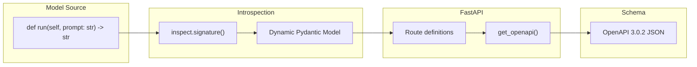

# Schema

The schema is an **OpenAPI 3.0.2 specification** that describes a model's interface. It's the contract between the model and everything that interacts with it.

## Why the Schema Exists

Every Cog model uses the same [Prediction API](./03-prediction-api.md) envelope format, but the `input` and `output` fields are model-specific. The schema captures what each model expects and produces.

```
┌─────────────────────────────────────────────────┐
│  PredictionRequest (fixed envelope)             │
│  ┌─────────────────────────────────────────┐    │
│  │  "input": { ... }  ← model-specific     │    │
│  └─────────────────────────────────────────┘    │
└─────────────────────────────────────────────────┘
                      ↑
            Schema defines this part
```

Without the schema, consumers would have no way to know:
- What inputs the model accepts
- What types those inputs should be
- What constraints apply (required fields, min/max values, allowed choices)
- What the output looks like

### How It's Used Today

| Consumer | What They Use the Schema For |
|----------|------------------------------|
| **Replicate platform** | Generate input forms in the web UI, validate requests before routing to models |
| **HTTP server (Pydantic)** | Validate incoming JSON, reject malformed requests before they reach user code |
| **CLI (`cog run`)** | Parse `-i key=value` flags into correctly-typed Python objects |
| **Swagger UI** | Interactive `/docs` endpoint for testing models locally |
| **API clients** | Know what to send and what to expect back without reading source code |

## What the Schema Captures

Given this runner:

```python
def run(
    self,
    prompt: str = Input(description="Text prompt"),
    steps: int = Input(default=50, ge=1, le=100),
    image: Path = Input(description="Input image"),
) -> Path:
```

The schema captures:

| From Code | In Schema |
|-----------|-----------|
| Parameter names | Property names in `Input` schema |
| Type hints (`str`, `int`, `Path`) | JSON Schema types (`string`, `integer`, `string` with `format: uri`) |
| `Input()` metadata | `description`, `default`, `minimum`, `maximum` |
| Parameter order | `x-order` extension |
| Return type | `Output` schema |

## How It's Generated



1. **Introspect** the `run()` method signature
2. **Create** a dynamic Pydantic model (`Input`) from the parameters
3. **Create** an `Output` model from the return type
4. **Define** FastAPI routes using these models
5. **Generate** OpenAPI spec from FastAPI's `get_openapi()`
6. **Apply fixes** for Pydantic v1/v2 compatibility

The same code path runs at build time (to embed in the image) and at runtime (to serve via HTTP).

## Where the Schema Lives

### In the Image

Embedded as a Docker label during build:

```bash
docker inspect my-model | jq -r '.[0].Config.Labels["run.cog.openapi_schema"]'
```

This allows extracting the schema without running the container - useful for the Replicate platform to understand models before deployment.

### At Runtime

| Endpoint | Format |
|----------|--------|
| `GET /openapi.json` | Raw OpenAPI spec |
| `GET /docs` | Swagger UI |

## Schema Structure

A simplified example:

```json
{
  "openapi": "3.0.2",
  "info": { "title": "Cog", "version": "0.1.0" },
  "paths": {
    "/predictions": {
      "post": {
        "requestBody": {
          "content": {
            "application/json": {
              "schema": { "$ref": "#/components/schemas/PredictionRequest" }
            }
          }
        }
      }
    }
  },
  "components": {
    "schemas": {
      "Input": {
        "type": "object",
        "properties": {
          "prompt": {
            "type": "string",
            "description": "Text prompt",
            "x-order": 0
          },
          "steps": {
            "type": "integer",
            "default": 50,
            "minimum": 1,
            "maximum": 100,
            "x-order": 1
          }
        },
        "required": ["prompt"]
      },
      "Output": {
        "type": "string",
        "format": "uri"
      },
      "PredictionRequest": { ... },
      "PredictionResponse": { ... }
    }
  }
}
```

## Type Mappings

How Python types become JSON Schema:

| Python | JSON Schema | Notes |
|--------|-------------|-------|
| `str` | `{"type": "string"}` | |
| `int` | `{"type": "integer"}` | |
| `float` | `{"type": "number"}` | |
| `bool` | `{"type": "boolean"}` | |
| `cog.Path` | `{"type": "string", "format": "uri"}` | URLs downloaded at runtime |
| `cog.Secret` | `{"type": "string", "format": "password", "x-cog-secret": true}` | Masked in logs |
| `List[T]` | `{"type": "array", "items": {...}}` | |
| `Optional[T]` | Type T with `nullable: true` | |
| `Literal["a", "b"]` | `{"enum": ["a", "b"]}` | |
| `Iterator[T]` | `{"type": "array", "x-cog-array-type": "iterator"}` | Streaming output |
| `ConcatenateIterator[T]` | Above + `"x-cog-array-display": "concatenate"` | Token streaming |

## Cog-Specific Extensions

The schema includes custom extensions (`x-*` fields):

| Extension | Purpose |
|-----------|---------|
| `x-order` | Preserves parameter order from function signature |
| `x-cog-array-type` | Marks iterators vs regular arrays |
| `x-cog-array-display` | Hints for how to display streaming output |
| `x-cog-secret` | Marks sensitive inputs |

## Pydantic v1/v2 Compatibility

Cog supports both Pydantic 1.x and 2.x. They represent optional fields differently in OpenAPI:

```python
# Pydantic 1: nullable in allOf construct
# Pydantic 2: anyOf with null type
# Cog normalizes both to: {"type": "T", "nullable": true}
```

This normalization ensures consumers see consistent schemas regardless of which Pydantic version the model uses.

## Code References

| File | Purpose |
|------|---------|
| `python/cog/predictor.py` | `get_input_type()`, `get_output_type()` |
| `python/cog/types.py` | Type definitions with schema hooks |
| `python/cog/server/http.py` | `custom_openapi()` |
| `python/cog/server/helpers.py` | Pydantic v1/v2 normalization |
| `python/cog/command/openapi_schema.py` | Build-time extraction |
| `pkg/image/build.go` | Schema validation and labeling |
