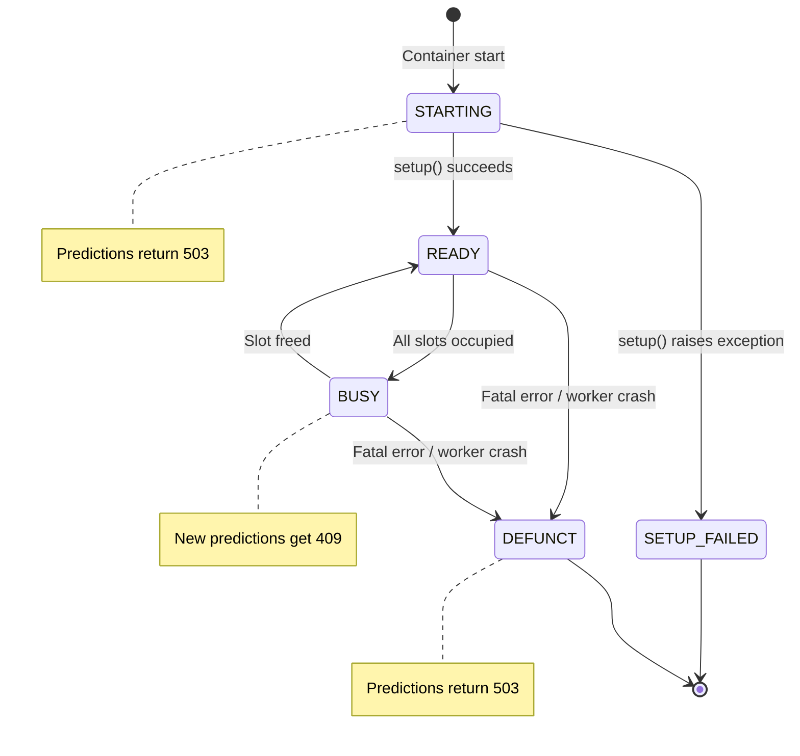
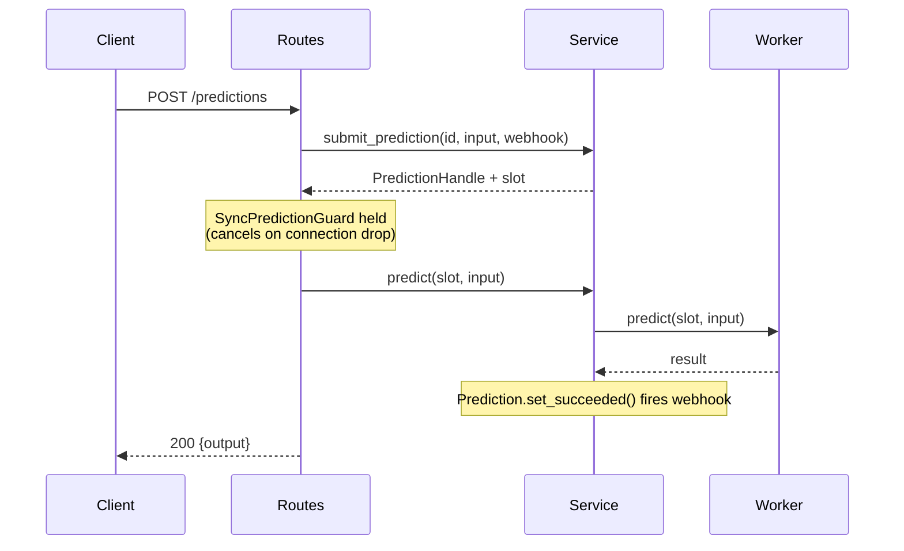
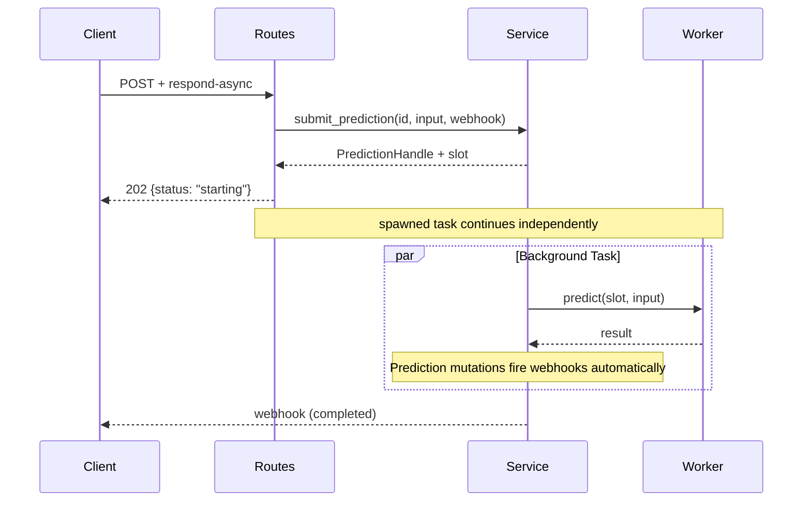
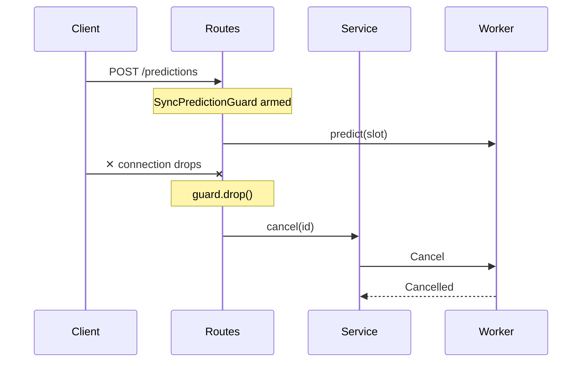

# Container Runtime

This document covers what happens when a Cog container runs. It's where the [Model Source](./01-model-source.md), [Schema](./02-schema.md), and [Prediction API](./03-prediction-api.md) come together.

## Overview

When a Cog container runs, it executes a **two-process architecture**: a Rust parent process (HTTP server + orchestrator) and a Python worker subprocess (predictor execution). The design isolates user model code from the HTTP server for stability, resource management, and clean shutdown handling.

The runtime is implemented in Rust using Axum for HTTP and PyO3 for Python integration, distributed as a Python wheel (`coglet`).

## High-Level Architecture

```
┌─────────────────────────────────────────────────────────────────────────────────┐
│                              HTTP Transport (axum)                               │
│  ┌─────────────┐  ┌─────────────┐  ┌─────────────┐  ┌─────────────────────────┐ │
│  │ POST        │  │ PUT         │  │ POST        │  │ GET                     │ │
│  │ /predictions│  │ /predictions│  │ /cancel     │  │ /health-check           │ │
│  │             │  │ /{id}       │  │             │  │ /openapi.json           │ │
│  └──────┬──────┘  └──────┬──────┘  └──────┬──────┘  └───────────┬─────────────┘ │
└─────────┼────────────────┼────────────────┼─────────────────────┼───────────────┘
          │                │                │                     │
          ▼                ▼                ▼                     ▼
┌─────────────────────────────────────────────────────────────────────────────────┐
│                            PredictionService                                     │
│  ┌────────────────────────────────────────────────────────────────────────────┐ │
│  │                    Active Predictions (DashMap)                            │ │
│  │  ┌─────────────────┐  ┌─────────────────┐  ┌─────────────────┐            │ │
│  │  │ PredictionEntry │  │ PredictionEntry │  │ PredictionEntry │  ...       │ │
│  │  │ ─────────────── │  │ ─────────────── │  │ ─────────────── │            │ │
│  │  │ prediction (Arc)│  │ prediction (Arc)│  │ prediction (Arc)│            │ │
│  │  │ cancel_token    │  │ cancel_token    │  │ cancel_token    │            │ │
│  │  │ input           │  │ input           │  │ input           │            │ │
│  │  └─────────────────┘  └─────────────────┘  └─────────────────┘            │ │
│  └────────────────────────────────────────────────────────────────────────────┘ │
│                                                                                  │
│  ┌────────────────────────────────────────────────────────────────────────────┐ │
│  │                           PermitPool                                       │ │
│  │  ┌────────┐  ┌────────┐  ┌────────┐                                       │ │
│  │  │ Permit │  │ Permit │  │ Permit │  (concurrency control)                │ │
│  │  │ slot_0 │  │ slot_1 │  │ slot_2 │                                       │ │
│  │  └────────┘  └────────┘  └────────┘                                       │ │
│  └────────────────────────────────────────────────────────────────────────────┘ │
│                                                                                  │
│  ┌────────────────────────────────────────────────────────────────────────────┐ │
│  │                        OrchestratorHandle                                  │ │
│  │  (slot_ids, control_tx for worker comms)                                   │ │
│  └────────────────────────────────────────────────────────────────────────────┘ │
└──────────────────────────────────┬──────────────────────────────────────────────┘
                                   │
                    Unix Socket (slot) + stdin/stdout (control)
                                   │
                                   ▼
┌─────────────────────────────────────────────────────────────────────────────────┐
│                         Worker Subprocess (Python)                               │
│  ┌────────────────────────────────────────────────────────────────────────────┐ │
│  │                              Predictor                                     │ │
│  │  ┌─────────────────────────────────────────────────────────────────────┐  │ │
│  │  │  setup()    →  runs once at startup                                 │  │ │
│  │  │  predict()  →  handles SlotRequest::Predict                         │  │ │
│  │  └─────────────────────────────────────────────────────────────────────┘  │ │
│  └────────────────────────────────────────────────────────────────────────────┘ │
└─────────────────────────────────────────────────────────────────────────────────┘
```

## Ownership Model

`PredictionService` is the single owner of all prediction state. Everything flows through it.

A prediction's lifecycle involves three key objects:

- **PredictionEntry** (in a concurrent DashMap) -- the source of truth for a prediction's state. Holds the `Prediction` state machine (shared via Arc), a cancellation token, and the original input.
- **PredictionSlot** -- RAII container that pairs a prediction with a concurrency permit. When the slot drops, the permit returns to the pool automatically.
- **PredictionHandle** -- returned to the HTTP route handler. For sync requests, calling `sync_guard()` creates a guard that cancels the prediction if the client connection drops.

The `Prediction` struct is itself a state machine -- its mutation methods (`set_processing`, `set_succeeded`, `append_log`, etc.) fire webhooks as a side effect. This keeps webhook delivery tightly coupled to state transitions rather than scattered across call sites.

## Process Roles

### tini (PID 1)
- **What**: Minimal init system (~30KB binary)
- **Why**: Proper signal forwarding to children, zombie process reaping
- **Entry**: `ENTRYPOINT ["/sbin/tini", "--"]`

### Parent Process (Rust HTTP Server)
- **Entry**: `CMD ["python", "-m", "cog.server.http"]` -- this thin Python launcher calls `coglet.server.serve()`
- **Responsibilities**:
  - HTTP API on port 5000 (Axum)
  - Request validation
  - Input file downloading (from URLs)
  - Webhook delivery with retry and trace context propagation
  - Output file uploads
  - Health state management
  - Worker subprocess lifecycle

### Worker Subprocess (Python)
- **Spawned via**: `python -c "import coglet; coglet.server._run_worker()"`
- **Responsibilities**:
  - Load user's predictor module
  - Run `setup()` once at startup
  - Execute `predict()` / `train()` methods
  - Capture stdout/stderr via ContextVar-based log routing
  - Send events back to parent via slot sockets

## Why Two Processes?

1. **Isolation**: User code crashes don't bring down the HTTP server
2. **Memory**: Fresh address space for model loading
3. **CUDA**: Clean GPU context initialization in worker
4. **Stability**: Server marks health as `DEFUNCT` and continues serving other endpoints if worker crashes
5. **Monitoring**: Parent tracks worker health independently

## Worker Subprocess Protocol

Communication between the Rust server and Python worker uses two channels:

### Control Channel (stdin/stdout -- JSON framed)

| Parent → Child | Child → Parent |
|----------------|----------------|
| `Init { predictor_ref, num_slots, ... }` | `Ready { slots, schema }` |
| `Cancel { slot }` | `Log { source, data }` |
| `Shutdown` | `Idle { slot }` |
| | `Failed { slot, error }` |
| | `ShuttingDown` |

### Slot Channel (Unix socket per slot -- JSON framed)

| Parent → Child | Child → Parent |
|----------------|----------------|
| `Predict { id, input }` | `Log { data }` |
| | `Output { value }` (streaming) |
| | `Done { output }` |
| | `Failed { error }` |
| | `Cancelled` |

## Health State Machine



## Prediction Flow

### Sync Request (POST /predictions)



**Key behavior**: The `SyncPredictionGuard` is held for the duration of the request. If the client connection drops, the guard is dropped and the prediction is automatically cancelled.

### Async Request (Prefer: respond-async)



**Key behavior**: No guard is held. The prediction continues even if the client disconnects.

### Connection Drop (Sync Mode)



## Invocation Path

How coglet gets invoked when running a Cog container:

```
┌─────────────────────────────────────────────────────────────────────────────┐
│                        cog predict / cog run                                │
│                               (CLI)                                         │
└─────────────────────────────────┬───────────────────────────────────────────┘
                                  │
                                  ▼
┌─────────────────────────────────────────────────────────────────────────────┐
│                     python -m cog.server.http                               │
│                                                                             │
│   import coglet                                                             │
│   coglet.server.serve(predictor_ref, port=5000)                             │
└─────────────────────────────────┬───────────────────────────────────────────┘
                                  │
                                  ▼
┌─────────────────────────────────────────────────────────────────────────────┐
│                          coglet (Rust)                                      │
│                                                                             │
│   ┌───────────────────────────────────────────────────────────────────┐     │
│   │  HTTP Server (axum)  :5000                                        │     │
│   │    /predictions, /health-check, etc.                              │     │
│   └───────────────────────────────────────────────────────────────────┘     │
│                              │                                              │
│                              ▼                                              │
│   ┌───────────────────────────────────────────────────────────────────┐     │
│   │  PredictionService (state, webhooks, permits)                      │     │
│   └───────────────────────────────────────────────────────────────────┘     │
│                              │                                              │
│                    Unix socket + pipes                                      │
│                              │                                              │
│                              ▼                                              │
│   ┌───────────────────────────────────────────────────────────────────┐     │
│   │  Worker subprocess (Python)                                       │     │
│   │    - loads predictor_ref                                          │     │
│   │    - runs setup()                                                 │     │
│   │    - handles predict() requests                                   │     │
│   └───────────────────────────────────────────────────────────────────┘     │
└─────────────────────────────────────────────────────────────────────────────┘
```

## Key Design Decisions

### Why Rust?
- **Performance**: Axum is faster than Python HTTP frameworks for request handling
- **Stability**: Server doesn't crash when user code fails
- **Resource management**: Better backpressure and concurrency control
- **Memory safety**: No Python GIL contention in HTTP layer

### Why PyO3?
- **ABI3 wheel**: Single wheel works across Python 3.10-3.13
- **Native performance**: Direct C API calls, no serialization overhead
- **Same predictor code**: Users don't change anything
- **Drop-in**: Same HTTP API, same behavior

### Why Subprocess (not in-process)?
- **Isolation**: Python crashes/segfaults don't kill server
- **CUDA context**: Clean GPU initialization per worker
- **Memory**: Fresh address space for model loading

### Why Slots (not async tasks)?
- **Predictable**: Fixed number of concurrent predictions
- **Fair**: Permits prevent starvation
- **Observable**: Easy to monitor slot usage
- **Simple**: No async complexity in worker subprocess

## Environment Variables

| Variable | Default | Purpose |
|----------|---------|---------|
| `PORT` | 5000 | HTTP server port |
| `COG_LOG_LEVEL` | INFO | Logging verbosity |
| `COG_MAX_CONCURRENCY` | 1 | Number of concurrent prediction slots |

## Where to Look

**coglet core** (`crates/coglet/src/`):
- `service.rs` -- `PredictionService`, the central coordinator. Start here.
- `orchestrator.rs` -- worker subprocess spawning and lifecycle
- `bridge/` -- IPC protocol definitions (`protocol.rs`) and Unix socket transport
- `permit/` -- slot-based concurrency control (`PermitPool`, `PredictionSlot`)
- `transport/http/` -- Axum HTTP server and route handlers
- `prediction.rs` -- prediction state machine, webhook firing on state transitions

**coglet-python** (`crates/coglet-python/src/`):
- `lib.rs` -- PyO3 module entry point: `serve()` and `_run_worker()`
- `predictor.rs` -- wraps the Python predictor class, handles sync/async detection
- `worker_bridge.rs` -- implements the `PredictHandler` trait for Python
- `log_writer.rs` -- ContextVar-based stdout/stderr routing per prediction slot

**Python launcher**: `python/cog/server/http.py` -- the thin entry point that calls `coglet.server.serve()`
