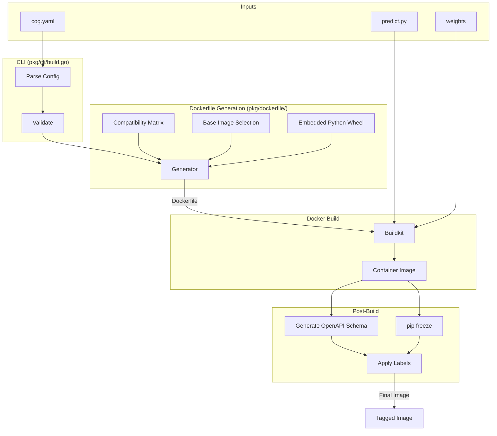
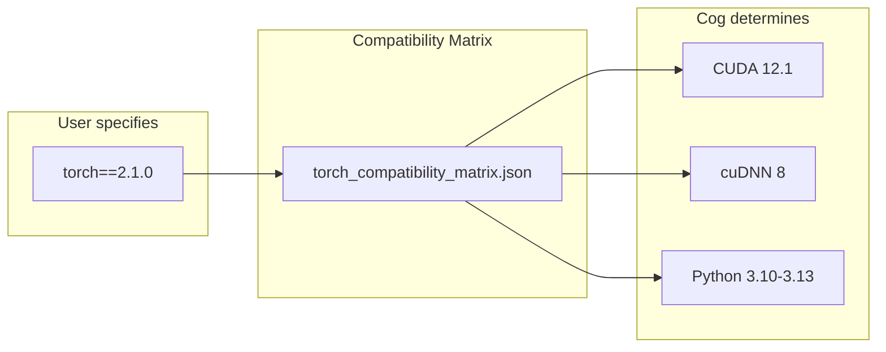
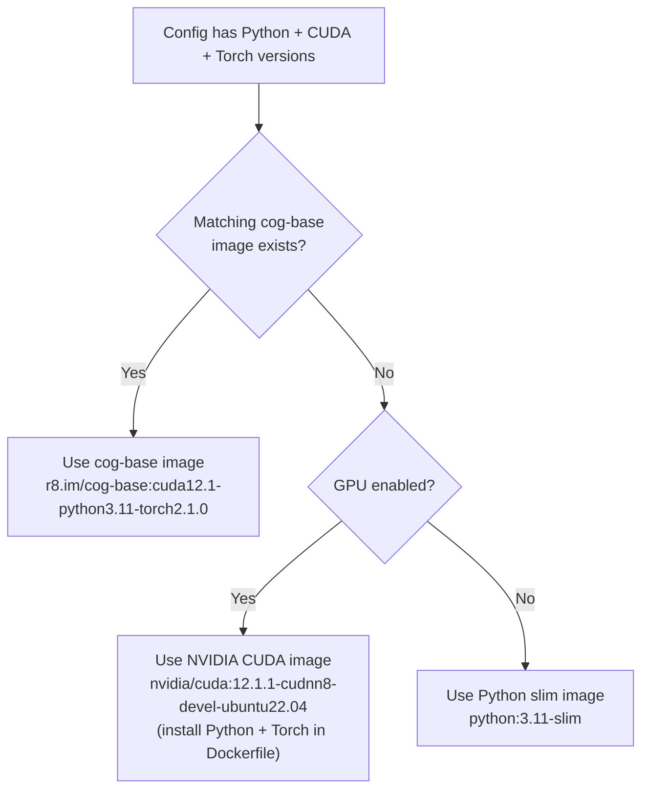

# Build System

The build system transforms [Model Source](./01-model-source.md) (cog.yaml + predict.py + weights) into a production-ready OCI image containing the [Container Runtime](./04-container-runtime.md).

## Build Flow



## Key Components

### 1. Config Parsing & Validation

Reads `cog.yaml` and validates/completes the configuration:
- Validates Python version (3.10-3.13)
- Auto-detects CUDA version from PyTorch/TensorFlow requirements
- Resolves package versions against compatibility matrix

```
cog.yaml (user provides)     →    Config (completed)
─────────────────────────         ─────────────────
gpu: true                         gpu: true
python_packages:                  cuda: "12.1"      ← auto-detected
  - torch==2.1.0                  cudnn: "8"        ← auto-detected
```

---

### 2. Dockerfile Generator

The generator produces a Dockerfile from the validated config.

#### Generated Dockerfile Sections

```dockerfile
# 1. Base image (cog-base, CUDA, or python-slim)
FROM r8.im/cog-base:cuda12.1-python3.11-torch2.1.0

# 2. System packages
RUN apt-get update && apt-get install -y ffmpeg

# 3. Python packages
RUN pip install -r requirements.txt

# 4. Cog wheel (embedded in CLI binary)
COPY cog-0.12.0-py3-none-any.whl /tmp/
RUN pip install /tmp/cog-0.12.0-py3-none-any.whl

# 5. User run commands
RUN echo "custom setup"

# 6. Copy source
WORKDIR /src
COPY . /src

# 7. Entrypoint
ENTRYPOINT ["/sbin/tini", "--"]
CMD ["python", "-m", "cog.server.http"]
```

---

### 3. Compatibility Matrix

PyTorch and TensorFlow releases are built against specific CUDA/cuDNN versions. The compatibility matrix captures these relationships from upstream release notes.



**Data files** (embedded JSON, generated by `tools/compatgen/`):
- `pkg/config/torch_compatibility_matrix.json` - PyTorch ↔ CUDA mappings
- `pkg/config/tf_compatibility_matrix.json` - TensorFlow ↔ CUDA mappings  
- `pkg/config/cuda_base_images.json` - Available NVIDIA base image tags

These are regenerated when new framework versions are released and embedded into the CLI binary at build time.

**What it stores** (for each framework release):
- Framework version (e.g., `torch==2.1.0`)
- Compatible CUDA versions
- Compatible cuDNN versions
- Compatible Python versions
- Package index URLs (for CUDA-specific wheels)

---

### 4. Base Image Selection

Base image selection uses the compatibility matrix to find a pre-built image that matches the required Python/CUDA/PyTorch combination.



#### Cog Base Images

Pre-built images hosted at `r8.im/cog-base` with Python, CUDA, cuDNN, and PyTorch already installed.

- Format: `r8.im/cog-base:cuda<version>-python<version>-torch<version>`
- Generated from the compatibility matrix (`BaseImageConfigurations()`)
- Includes common system packages (ffmpeg, git, curl, etc.)
- Faster builds since heavy dependencies are pre-installed

#### Fallback: NVIDIA CUDA Images

When no matching cog-base exists (e.g., unusual version combination):
- Uses official `nvidia/cuda` images
- Dockerfile installs Python via pyenv
- Dockerfile installs PyTorch and other packages via pip
- Slower builds but supports any valid combination

---

### 5. Embedded Python Wheel

The Cog Python SDK is embedded in the Go binary at compile time and injected into images during build.

During build, the wheel is:
1. Selected based on configuration (see below)
2. Copied into the Docker build context
3. Installed via pip

#### Wheel Selection

The `COG_WHEEL` environment variable controls which wheel is installed:

| Value | Source |
|-------|--------|
| (unset) | Embedded `cog` wheel (default) |
| `cog` | Embedded `cog` wheel |
| `coglet` | Experimental runtime (temporary compatibility) |
| `https://...` | Download wheel from URL |
| `/path/to/file.whl` | Use local wheel file |

This allows testing development versions of the SDK or pinning to specific releases. The upcoming unified runtime will also use this mechanism for selection.

---

### 6. Post-Build: Labels & Schema

After the main build, Cog:

1. **Runs the container** to generate OpenAPI schema
2. **Runs pip freeze** to capture installed packages
3. **Applies labels** with metadata

#### Image Labels

| Label | Content |
|-------|---------|
| `run.cog.version` | Cog CLI version |
| `run.cog.config` | Serialized cog.yaml |
| `run.cog.openapi_schema` | OpenAPI spec from type hints |
| `run.cog.pip_freeze` | Installed package versions |

These labels can be fetched from a remote registry or local image store (like containerd) without pulling the full image. This allows tooling - both the Cog CLI during development and production infrastructure - to inspect model metadata and make decisions about how to run a model before booting it.

---

## Image Layer Structure

A built Cog image has layers in this order (bottom to top):

```
┌─────────────────────────────────────────────────┐
│  COPY . /src                                    │  ← User code + weights
├─────────────────────────────────────────────────┤
│  RUN commands (from cog.yaml)                   │  ← Custom build steps
├─────────────────────────────────────────────────┤
│  pip install (python_packages)                  │  ← Python dependencies
├─────────────────────────────────────────────────┤
│  Cog wheel install                              │  ← Cog runtime
├─────────────────────────────────────────────────┤
│  apt-get install (system_packages)              │  ← System dependencies
├─────────────────────────────────────────────────┤
│  tini init                                      │  ← Process manager
├─────────────────────────────────────────────────┤
│                                                 │
│  Base image                                     │  ← Largest layer
│  (OS, Python, CUDA, cuDNN, PyTorch)             │     ~5-15 GB for GPU images
│                                                 │
└─────────────────────────────────────────────────┘
```

The base image is by far the largest layer. Using a matching `cog-base` image means this layer is shared across builds and doesn't need to be re-downloaded or rebuilt.

---

## Code Reference

| Component | Location |
|-----------|----------|
| CLI command | `pkg/cli/build.go` |
| Build orchestration | `pkg/image/build.go` |
| Dockerfile generator | `pkg/dockerfile/standard_generator.go` |
| Base image selection | `pkg/dockerfile/base.go` |
| Compatibility matrix | `pkg/config/compatibility.go` |
| Embedded wheels | `pkg/wheels/wheels.go` |
| Label definitions | `pkg/docker/command/manifest.go` |
