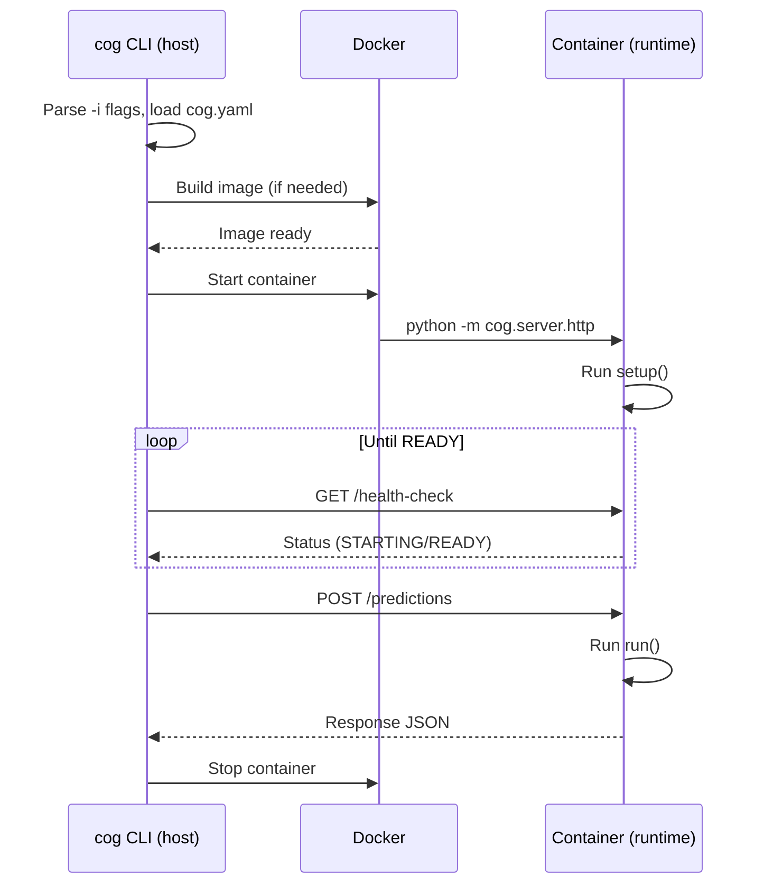

# CLI

The Cog CLI is a Go binary that provides commands for the full model lifecycle: development, building, testing, and deployment. This document covers what each command does and how it connects to the systems described in previous docs.

**Important**: Model code always runs inside a container, never on the host machine. Commands like `cog run`, `cog train`, and `cog serve` build an image, start a container, and interact with it via the [Prediction API](./03-prediction-api.md). The CLI orchestrates this, but the model execution happens in the containerized [Container Runtime](./04-container-runtime.md).

## Commands Overview

| Command | Job To Be Done |
|---------|----------------|
| `cog init` | Bootstrap a new model project |
| `cog build` | Create a container image |
| `cog run` | Run a prediction in a container |
| `cog train` | Run training in a container |
| `cog run` | Run arbitrary commands in a container |
| `cog serve` | Start HTTP server in a container |
| `cog push` | Deploy to Replicate |
| `cog login` | Authenticate with Replicate |

## Development Commands

### cog init

**Job**: Create a starter `cog.yaml` and `run.py` for a new model.

```bash
cog init
```

Creates:
- `cog.yaml` with sensible defaults
- `run.py` with a skeleton Runner class

**Code**: `pkg/cli/init.go`

---

### cog run

**Job**: Run a prediction in a container.

```bash
cog run -i prompt="A photo of a cat" -i steps=50
```

What happens:
1. Builds the image (if needed)
2. Starts a container running the [Container Runtime](./04-container-runtime.md)
3. Parses `-i` flags against the [Schema](./02-schema.md)
4. Sends a [PredictionRequest](./03-prediction-api.md) to the container's HTTP API
5. Streams output back to terminal

Input types are inferred from the schema:
- Strings: `-i prompt="hello"`
- Numbers: `-i steps=50`
- Files: `-i image=@photo.jpg` (uploaded to container)
- URLs: `-i image=https://example.com/photo.jpg`

**Code**: `pkg/cli/predict.go`

---

### cog train

**Job**: Run training in a container.

```bash
cog train -i data=@dataset.zip -i epochs=10
```

Same as `cog run` but calls the `train()` method instead of `run()`.

**Code**: `pkg/cli/train.go`

---

### cog run

**Job**: Run arbitrary commands in a container.

```bash
cog run python -c "import torch; print(torch.cuda.is_available())"
cog run bash
```

Builds the image (if needed), starts a container, and runs the specified command inside it. Useful for:
- Debugging the container environment
- Running one-off scripts
- Interactive exploration

**Code**: `pkg/cli/run.go`

---

### cog serve

**Job**: Start the HTTP server in a container for testing.

```bash
cog serve
# Server running at http://localhost:5000
```

Builds the image (if needed) and starts a container running the [Container Runtime](./04-container-runtime.md). The container's port 5000 is exposed to the host. You can then:
- Send requests to `POST /predictions`
- View Swagger UI at `/docs`
- Test webhooks

**Code**: `pkg/cli/serve.go`

## Build Commands

### cog build

**Job**: Build a container image from [Model Source](./01-model-source.md).

```bash
cog build -t my-model
```

What happens (see [Build System](./05-build-system.md) for details):

1. **Parse** `cog.yaml`
2. **Resolve** CUDA/cuDNN versions from compatibility matrix
3. **Generate** Dockerfile
4. **Build** image via Docker/Buildkit
5. **Run** container to extract [Schema](./02-schema.md)
6. **Apply** labels (schema, config, pip freeze)

Key flags:
- `-t, --tag`: Image tag
- `--no-cache`: Disable Docker cache
- `--separate-weights`: Exclude weights from image (for separate upload)

**Code**: `pkg/cli/build.go`, `pkg/image/build.go`

## Deployment Commands

### cog push

**Job**: Build and push to Replicate.

```bash
cog push r8.im/username/model-name
```

What happens:
1. Builds image (like `cog build`)
2. Pushes to Replicate's registry
3. Registers model with Replicate API

The image tag must be a Replicate model reference (`r8.im/owner/name`).

**Code**: `pkg/cli/push.go`, `pkg/api/client.go`

---

### cog login

**Job**: Authenticate with Replicate.

```bash
cog login
# or
cog login --token-stdin < token.txt
```

Stores credentials for `cog push`.

**Code**: `pkg/cli/login.go`

## How CLI Commands Interact with Containers

Commands like `run`, `train`, and `serve` follow the same pattern: build an image, start a container, communicate via HTTP. The CLI never runs model code directly.



For what happens inside the container (setup, run, IPC), see [Container Runtime](./04-container-runtime.md).

## CLI Architecture

The CLI is built with [Cobra](https://github.com/spf13/cobra) (Go CLI framework).

```
cmd/cog/
└── cog.go          # Entry point

pkg/cli/
├── root.go         # Root command, subcommand registration
├── build.go        # cog build
├── predict.go      # cog run
├── train.go        # cog train
├── run.go          # cog run
├── serve.go        # cog serve
├── push.go         # cog push
├── login.go        # cog login
└── init.go         # cog init
```

Commands delegate to packages:
- `pkg/image/` - Image building
- `pkg/dockerfile/` - Dockerfile generation
- `pkg/docker/` - Docker client operations
- `pkg/config/` - cog.yaml parsing
- `pkg/api/` - Replicate API client
- `pkg/run/` - Local prediction execution

## Code References

| File | Purpose |
|------|---------|
| `pkg/cli/root.go` | Command registration |
| `pkg/cli/build.go` | Build command |
| `pkg/cli/predict.go` | Run command, input parsing |
| `pkg/cli/push.go` | Push command |
| `pkg/image/build.go` | Build orchestration |
| `pkg/run/runner.go` | Local prediction client |
