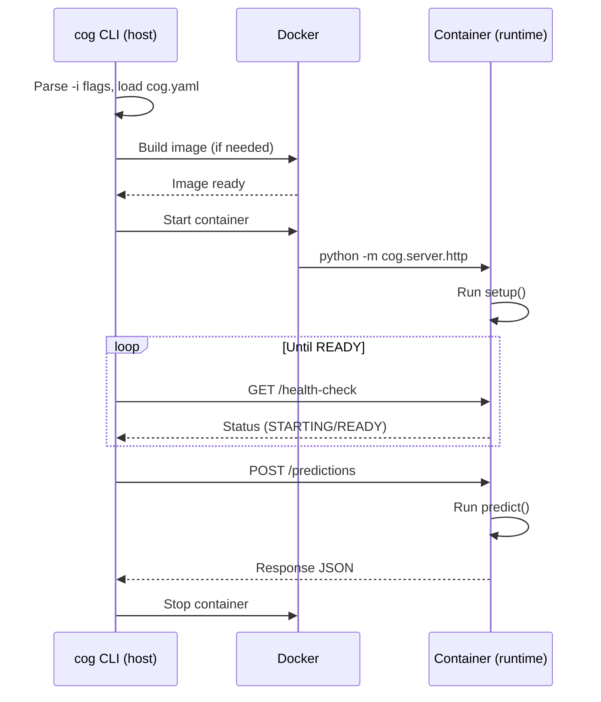

# CLI

The Cog CLI is a Go binary that provides commands for the full model lifecycle: development, building, testing, and deployment. This document covers what each command does and how it connects to the systems described in previous docs.

**Important**: Model code always runs inside a container, never on the host machine. Commands like `cog predict` and `cog serve` build an image, start a container, and interact with it via the [Prediction API](./03-prediction-api.md). The CLI orchestrates this, but the model execution happens in the containerized [Container Runtime](./04-container-runtime.md).

## Commands Overview

| Command       | Job To Be Done                        |
| ------------- | ------------------------------------- |
| `cog init`    | Bootstrap a new model project         |
| `cog build`   | Create a container image              |
| `cog predict` | Run a prediction in a container       |
| `cog exec`    | Run arbitrary commands in a container |
| `cog serve`   | Start HTTP server in a container      |
| `cog push`    | Deploy to Replicate                   |
| `cog login`   | Authenticate with Replicate           |

## Development Commands

### cog init

**Job**: Create a starter `cog.yaml` and `predict.py` for a new model.

```bash
cog init
```

Creates:

- `cog.yaml` with sensible defaults
- `predict.py` with a skeleton Predictor class

**Code**: `pkg/cli/init.go`

---

### cog predict

**Job**: Run a prediction in a container.

```bash
cog predict -i prompt="A photo of a cat" -i steps=50
```

What happens:

1. Builds the image (if needed)
2. Starts a container running the [Container Runtime](./04-container-runtime.md)
3. Parses `-i` flags against the [Schema](./02-schema.md)
4. Sends a [PredictionRequest](./03-prediction-api.md) to the container's HTTP API
5. Streams output back to terminal

Input types are inferred from the schema:

- Strings: `-i prompt="hello"`
- Numbers: `-i steps=50`
- Files: `-i image=@photo.jpg` (uploaded to container)
- URLs: `-i image=https://example.com/photo.jpg`

**Code**: `pkg/cli/predict.go`

---

### cog exec

**Job**: Run arbitrary commands in a container.

```bash
cog exec python -c "import torch; print(torch.cuda.is_available())"
cog exec bash
```

Builds the image (if needed), starts a container, and runs the specified command inside it. Useful for:

- Debugging the container environment
- Running one-off scripts
- Interactive exploration

**Code**: `pkg/cli/exec.go`

---

### cog serve

**Job**: Start the HTTP server in a container for testing.

```bash
cog serve
# Server running at http://localhost:5000
```

Builds the image (if needed) and starts a container running the [Container Runtime](./04-container-runtime.md). The container's port 5000 is exposed to the host. You can then:

- Send requests to `POST /predictions`
- View OpenAPI spec at `/openapi.json`
- Check health at `/health-check`

**Code**: `pkg/cli/serve.go`

## Build Commands

### cog build

**Job**: Build a container image from [Model Source](./01-model-source.md).

```bash
cog build -t my-model
```

What happens (see [Build System](./05-build-system.md) for details):

1. **Parse** `cog.yaml`
2. **Resolve** CUDA/cuDNN versions from compatibility matrix
3. **Generate** Dockerfile
4. **Build** image via Docker/Buildkit
5. **Run** container to extract [Schema](./02-schema.md)
6. **Apply** labels (schema, config, pip freeze)

Key flags:

- `-t, --tag`: Image tag
- `--no-cache`: Disable Docker cache
- `--separate-weights`: Exclude weights from image (for separate upload)

**Code**: `pkg/cli/build.go`, `pkg/image/build.go`

## Deployment Commands

### cog push

**Job**: Build and push to Replicate.

```bash
cog push r8.im/username/model-name
```

What happens:

1. Builds image (like `cog build`)
2. Pushes to Replicate's registry
3. Registers model with Replicate API

The image tag must be a Replicate model reference (`r8.im/owner/name`).

**Code**: `pkg/cli/push.go`, `pkg/web/`

---

### cog login

**Job**: Authenticate with Replicate.

```bash
cog login
# or
cog login --token-stdin < token.txt
```

Stores credentials for `cog push`.

**Code**: `pkg/cli/login.go`

---

### Hidden / Internal Commands

These commands exist but are hidden from `cog --help`:

- **`cog debug`** -- Generates the Dockerfile from cog.yaml without building (useful for debugging build issues)
- **`cog inspect`** -- Inspects model images and OCI indices
- **`cog weights`** -- Parent command for `weights build`, `weights push`, `weights inspect`

There's also a separate `base-image` binary (`cmd/base-image/`) with subcommands for managing Cog base images (`dockerfile`, `build`, `generate-matrix`). This isn't a `cog` subcommand.

## How CLI Commands Interact with Containers

Commands like `predict` and `serve` follow the same pattern: build an image, start a container, communicate via HTTP. The CLI never runs model code directly.


```mermaid
sequenceDiagram
    participant CLI as cog CLI (host)
    participant Docker
    participant Container as Container (runtime)

    CLI->>CLI: Parse -i flags, load cog.yaml
    CLI->>Docker: Build image (if needed)
    Docker-->>CLI: Image ready

    CLI->>Docker: Start container
    Docker->>Container: python -m cog.server.http
    Container->>Container: Run setup()

    loop Until READY
        CLI->>Container: GET /health-check
        Container-->>CLI: Status (STARTING/READY)
    end

    CLI->>Container: POST /predictions
    Container->>Container: Run predict()
    Container-->>CLI: Response JSON

    CLI->>Docker: Stop container
```

For what happens inside the container (setup, predict, IPC), see [Container Runtime](./04-container-runtime.md).

## CLI Architecture

The CLI is built with [Cobra](https://github.com/spf13/cobra) (Go CLI framework).

```
cmd/cog/
└── cog.go          # Entry point

pkg/cli/
├── root.go         # Root command, subcommand registration
├── build.go        # cog build
├── predict.go      # cog predict
├── exec.go         # cog exec
├── serve.go        # cog serve
├── push.go         # cog push
├── login.go        # cog login
└── init.go         # cog init
```

Commands delegate to packages under `pkg/`:

**Core:**

- `pkg/cli/` -- Cobra command definitions
- `pkg/config/` -- cog.yaml parsing and validation, compatibility matrices
- `pkg/image/` -- Build orchestration (ties together config, Dockerfile generation, schema gen)
- `pkg/dockerfile/` -- Dockerfile generation and base image selection
- `pkg/docker/` -- Docker client operations
- `pkg/predict/` -- Local prediction execution (talks to container's HTTP API)
- `pkg/schema/` -- Static schema generator (tree-sitter, experimental)
- `pkg/wheels/` -- SDK and coglet wheel resolution

**Infrastructure:**

- `pkg/web/` -- Replicate API client (for `cog push`)
- `pkg/http/` -- Authenticated HTTP transport
- `pkg/registry/` -- OCI/Docker registry client
- `pkg/model/` -- OCI artifact domain model
- `pkg/weights/` -- Weight file discovery and checksums
- `pkg/errors/` -- `CodedError` for user-facing errors with error codes

**Utilities:**

- `pkg/dockercontext/` -- Docker build context directory management
- `pkg/dockerignore/` -- `.dockerignore` parsing
- `pkg/requirements/` -- `requirements.txt` parsing
- `pkg/env/` -- `R8_*` environment variable config
- `pkg/update/` -- CLI version update checker
- `pkg/global/` -- Build-time metadata, process-wide config
- `pkg/provider/` -- Abstracts registry-specific behavior for push workflows
