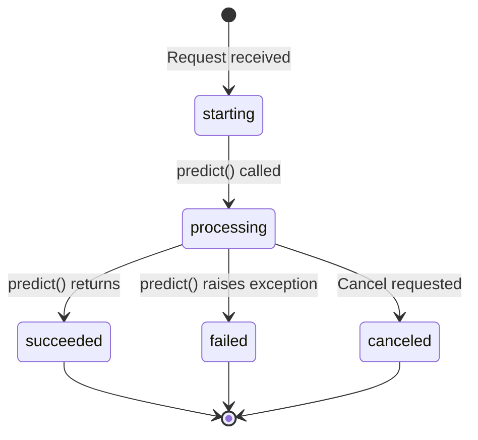

# Prediction API (FFI/Rust)

The FFI runtime implements the same Prediction API as the legacy runtime, using the same envelope format and endpoints. This document highlights FFI-specific behavior and implementation details.

> **Note**: The API surface is identical to the [legacy implementation](../legacy/03-prediction-api.md). Clients don't need to change code when switching runtimes.

## Endpoints

| Endpoint | Method | Purpose | FFI Notes |
|----------|--------|---------|-----------|
| `POST /predictions` | Create | Start a new prediction | Uses `SyncPredictionGuard` for automatic cancellation |
| `PUT /predictions/{id}` | Create (idempotent) | Start or retrieve existing prediction | Concurrent-safe with DashMap |
| `POST /predictions/{id}/cancel` | Cancel | Cancel a running prediction | Uses cancel tokens propagated to worker |
| `GET /health-check` | Health | Check server status | Returns health state machine status |
| `GET /` | Index | List available endpoints | Static route |
| `GET /openapi.json` | Schema | OpenAPI specification | Cached from worker `Ready` event |

## FFI-Specific Behaviors

### Connection Drop Handling

**Key difference from legacy**: Synchronous predictions automatically cancel when the client connection drops.

```rust
// SyncPredictionGuard is RAII - drops when connection closes
let guard = handle.sync_guard();
let result = service.predict(slot, input).await;
// If connection drops here, guard.drop() cancels the prediction
```

This prevents wasted computation on predictions where the client is no longer listening.

### Health States

The FFI runtime uses a more detailed health state machine. The `/health-check` endpoint always returns HTTP 200 with the status in the JSON body:

| State | JSON `status` | Condition |
|-------|---------------|-----------|
| `STARTING` | `"STARTING"` | Worker subprocess initializing |
| `READY` | `"READY"` | Worker ready, slots available |
| `BUSY` | `"BUSY"` | All slots occupied (backpressure) |
| `SETUP_FAILED` | `"SETUP_FAILED"` | `setup()` threw exception |
| `DEFUNCT` | `"DEFUNCT"` | Fatal error, worker crashed |

**New behavior**: When all concurrency slots are occupied, new predictions receive `409 Conflict` instead of queuing. Clients should implement retry with backoff.

> **Note**: Prediction endpoints return 503 when health is not `READY`.

### Idempotent PUT Behavior

The FFI runtime uses a concurrent-safe DashMap for prediction state:

```rust
// Atomic check-or-insert
match supervisor.get_state(id) {
    Some(state) => return 202 + state,  // Already exists
    None => {
        supervisor.submit(id, input);   // Create new
        return 202 + starting_state;
    }
}
```

This is fully thread-safe without locks, unlike the legacy runtime which uses Python's asyncio locks.

## Request Flow Differences

### Sync Prediction (POST /predictions)

**Legacy**:
```python
# Connection drop has no effect
result = await runner.predict(input)
return result
```

**FFI**:
```rust
// Connection drop triggers guard.drop() → cancellation
let guard = handle.sync_guard();  // RAII guard
let result = service.predict(slot, input).await;
drop(guard);  // Or automatic on scope exit
return result;
```

### Async Prediction (Prefer: respond-async)

Behavior is identical to legacy, but implemented differently:

**Legacy**: Uses asyncio tasks
**FFI**: Uses tokio tasks with cancel tokens

```rust
tokio::spawn(async move {
    let result = service.predict(slot, input).await;
    supervisor.update_status(id, result);
    supervisor.send_webhook(id).await;
    supervisor.cleanup(id);
});
```

### Cancellation Propagation

**Legacy**: Sends `SIGUSR1` signal to child process

**FFI**: Uses IPC message + different strategies for sync vs async predictors:

```
Parent: ControlRequest::Cancel { slot }
    │
    └─▶ Worker: handler.cancel(slot)
```

**Sync Predictors:**
```
handler.cancel(slot)
    │
    ├─▶ Set CANCEL_REQUESTED flag for slot
    │
    ├─▶ Send SIGUSR1 to self
    │
    └─▶ Signal handler: raise KeyboardInterrupt (if in cancelable region)

Prediction code:
    with CancelableGuard():  # Sets CANCELABLE=true
        predictor.predict()  # Can be interrupted
    # CANCELABLE=false on exit
```

**Async Predictors:**
```
handler.cancel(slot)
    │
    ├─▶ Get future from slot state
    └─▶ future.cancel()
            │
            └─▶ Python raises asyncio.CancelledError
```

This provides more reliable cancellation with proper handling for both sync and async execution models.

## Concurrency Model

### Slot-Based Permits

The FFI runtime uses explicit permit tokens instead of async task limits:

```rust
// Acquire permit (blocks if all slots busy)
let permit = permit_pool.acquire().await?;

// Permit is held during prediction
let slot_id = permit.slot_id();
let result = orchestrator.predict(slot_id, input).await;

// Permit automatically returned on drop
drop(permit);  // Or automatic on scope exit
```

**Advantages**:
- Fixed, predictable concurrency
- Fair queuing (FIFO permit acquisition)
- Observable slot usage in metrics
- No task explosion

### Configuration

```yaml
# cog.yaml
concurrency:
  max: 5
```

This creates 5 slots in the PermitPool. Each slot corresponds to one Unix socket connection to the worker subprocess.

## File Handling

File handling is identical to legacy (URLs downloaded to temp files, outputs uploaded), but the implementation differs:

**Legacy**: Uses Python `aiohttp` + `requests`

**FFI**: Uses Rust `reqwest` with connection pooling:

```rust
// Download input files
let client = reqwest::Client::builder()
    .connection_pool_idle_timeout(Duration::from_secs(30))
    .build()?;

let bytes = client.get(url).send().await?.bytes().await?;
tokio::fs::write(temp_path, bytes).await?;
```

This provides better performance for large file downloads.

## Webhooks

Webhook delivery is similar but with improvements:

### Retry Logic

**Legacy**: Simple exponential backoff

**FFI**: Structured retry with observability:

```rust
let retry_policy = ExponentialBackoff::builder()
    .max_elapsed_time(Some(Duration::from_secs(60)))
    .build();

let webhook_sender = WebhookSender::new(client, retry_policy);
webhook_sender.send_with_retry(url, payload).await?;
```

### Trace Context Propagation

The FFI runtime automatically propagates OpenTelemetry trace context in webhook headers:

```rust
// Automatic trace propagation
headers.insert("traceparent", trace_id);
headers.insert("tracestate", trace_state);
```

This enables distributed tracing across prediction → webhook → downstream services.

## Status Lifecycle

The status lifecycle is identical to legacy:



However, state transitions are managed by the PredictionSupervisor with atomic updates:

```rust
// Atomic state transition
supervisor.update_status(id, Status::Processing);
// ... prediction runs ...
supervisor.update_status(id, Status::Succeeded { output });
```

## Dynamic Payload Handling

Input validation and output serialization work the same as legacy:

1. **Parse JSON** → Extract `input` from request body
2. **Validate against schema** → Pydantic checks types (in worker subprocess)
3. **Download files** → Rust HTTP client fetches URLs
4. **Send to worker** → JSON-framed message via Unix socket
5. **Call predict()** → Python worker executes user code
6. **Capture output** → Worker sends back via slot channel
7. **Upload files** → Rust uploads to storage
8. **Serialize** → Return JSON response

The key difference is that steps 1, 3, 7, 8 happen in Rust (faster), while steps 2, 5, 6 happen in Python (same as legacy).

## Error Handling

### Worker Crashes

**Legacy**: Parent process becomes unstable, may need restart

**FFI**: Server marks health as `DEFUNCT` but continues serving other endpoints:

```rust
// Worker process died
match worker.wait().await {
    Ok(status) if !status.success() => {
        health.set(Health::Defunct);
        // HTTP server still runs, returns 503 for predictions
    }
}
```

### Setup Failures

Both runtimes mark the container as unhealthy, but FFI provides more detail:

```rust
// Detailed setup failure
match control_rx.recv().await? {
    ControlResponse::Failed { error } => {
        health.set(Health::SetupFailed { reason: error });
        // Include error in health-check response
    }
}
```

## Performance Characteristics

| Operation | Legacy | FFI | Improvement |
|-----------|--------|-----|-------------|
| Request parsing | Pydantic (Python) | serde (Rust) | ~3x faster |
| File download | aiohttp | reqwest | ~2x faster |
| Concurrency overhead | asyncio tasks | Tokio + permits | ~50% less memory |
| Webhook delivery | Sequential retries | Concurrent + backoff | Better throughput |
| State management | asyncio locks | DashMap (lock-free) | No contention |

## Environment Variables

FFI-specific variables:

| Variable | Default | Purpose |
|----------|---------|---------|
| `USE_COGLET` | unset | Enable FFI runtime (set to any value) |
| `COG_CONCURRENCY_SLOTS` | 1 | Number of prediction slots |
| `COG_WORKER_TIMEOUT` | 300s | Worker subprocess timeout |
| `RUST_LOG` | info | Rust logging (tracing crate) |

Legacy variables like `COG_MAX_CONCURRENCY` are ignored when using FFI.

## Code References

| File | Purpose |
|------|---------|
| `crates/coglet/src/transport/http/routes.rs` | HTTP endpoint handlers |
| `crates/coglet/src/supervisor.rs` | Prediction state management |
| `crates/coglet/src/webhook.rs` | Webhook delivery with retries |
| `crates/coglet/src/bridge/protocol.rs` | IPC message types |
| `crates/coglet/src/permit/pool.rs` | Slot-based concurrency |

## Migration Notes

When switching from legacy to FFI runtime:

✅ **No changes needed**:
- HTTP API endpoints
- Request/response format
- Predictor code
- Client code

⚠️ **Behavioral differences**:
- Sync predictions cancel on connection drop
- 409 responses when at capacity (not queuing)
- Different health state granularity
- Different environment variables

📈 **Improvements**:
- ~2x faster HTTP layer
- Better resource management
- More reliable cancellation
- Worker crash resilience
