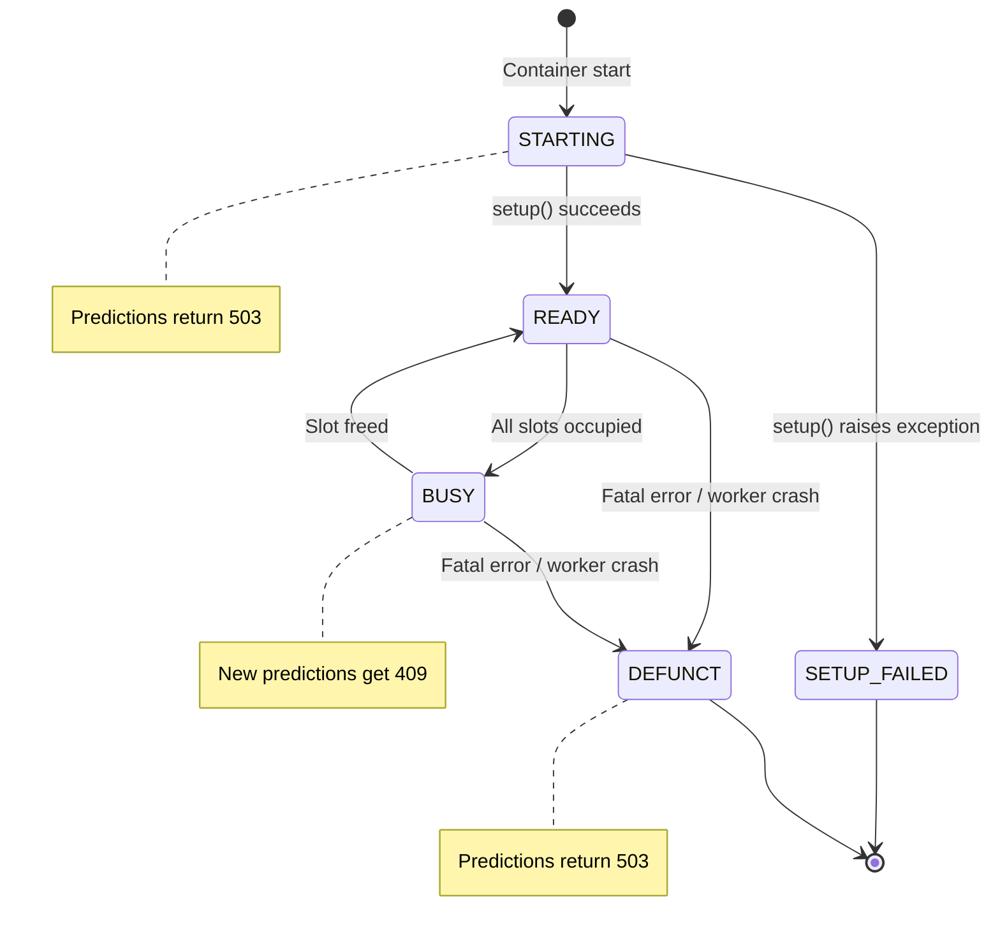
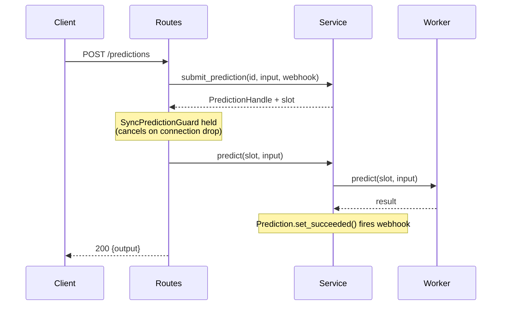
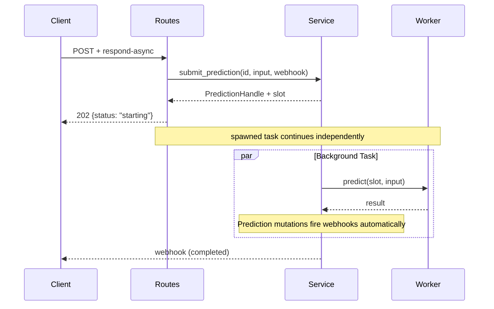
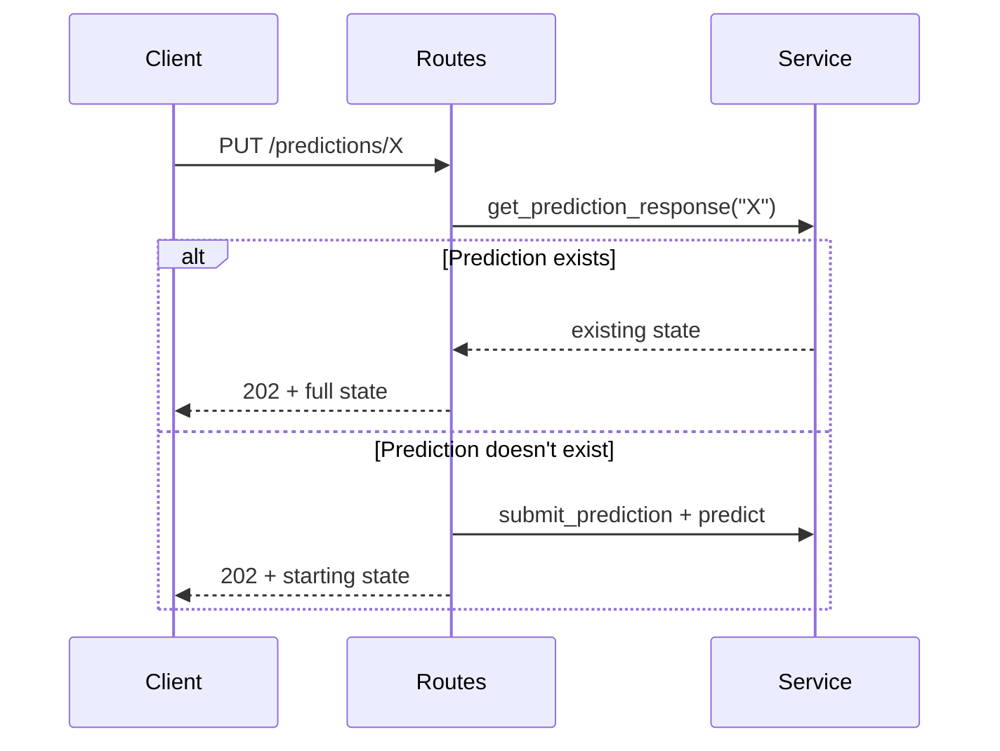

# Container Runtime (FFI/Rust)

This document covers the FFI runtime implementation using Rust with PyO3 bindings. This is a complete rewrite of the HTTP server, moving from Python/FastAPI to Rust/Axum with a PyO3 ABI3 wheel.

## Overview

The FFI runtime provides significant improvements over the legacy Python runtime:
- **Rust HTTP server (Axum)**: Faster request handling, better backpressure management
- **Worker isolation**: Python predictor crashes don't kill the server
- **Slot-based concurrency**: Predictable resource control with permit pools
- **Same API surface**: Drop-in replacement for the legacy runtime
- **Subprocess reuse**: Predictor stays loaded between requests

## High-Level Architecture

```
┌─────────────────────────────────────────────────────────────────────────────────┐
│                              HTTP Transport (axum)                               │
│  ┌─────────────┐  ┌─────────────┐  ┌─────────────┐  ┌─────────────────────────┐ │
│  │ POST        │  │ PUT         │  │ POST        │  │ GET                     │ │
│  │ /predictions│  │ /predictions│  │ /cancel     │  │ /health-check           │ │
│  │             │  │ /{id}       │  │             │  │ /openapi.json           │ │
│  └──────┬──────┘  └──────┬──────┘  └──────┬──────┘  └───────────┬─────────────┘ │
└─────────┼────────────────┼────────────────┼─────────────────────┼───────────────┘
          │                │                │                     │
          ▼                ▼                ▼                     ▼
┌─────────────────────────────────────────────────────────────────────────────────┐
│                            PredictionService                                     │
│  ┌────────────────────────────────────────────────────────────────────────────┐ │
│  │                    Active Predictions (DashMap)                            │ │
│  │  ┌─────────────────┐  ┌─────────────────┐  ┌─────────────────┐            │ │
│  │  �� PredictionEntry │  │ PredictionEntry │  │ PredictionEntry │  ...       │ │
│  │  │ ─────────────── │  │ ─────────────── │  │ ─────────────── │            │ │
│  │  │ prediction (Arc)│  │ prediction (Arc)│  │ prediction (Arc)│            │ │
│  │  │ cancel_token    │  │ cancel_token    │  │ cancel_token    │            │ │
│  │  │ input           │  │ input           │  │ input           │            │ │
│  │  └─────────────────┘  └─────────────────┘  └─────────────────┘            │ │
│  └────────────────────────────────────────────────────────────────────────────┘ │
│                                                                                  │
│  ┌────────────────────────────────────────────────────────────────────────────┐ │
│  │                           PermitPool                                       │ │
│  │  ┌────────┐  ┌────────┐  ┌────────┐                                       │ │
│  │  │ Permit │  │ Permit │  │ Permit │  (concurrency control)                │ │
│  │  │ slot_0 │  │ slot_1 │  │ slot_2 │                                       │ │
│  │  └────────┘  └────────┘  └────────┘                                       │ │
│  └────────────────────────────────────────────────────────────────────────────┘ │
│                                                                                  │
│  ┌────────────────────────────────────────────────────────────────────────────┐ │
│  │                        OrchestratorHandle                                  │ │
│  │  (slot_ids, control_tx for worker comms)                                   │ │
│  └────────────────────────────────────────────────────────────────────────────┘ │
└──────────────────────────────────┬──────────────────────────────────────────────┘
                                   │
                    Unix Socket (slot) + stdin/stdout (control)
                                   │
                                   ▼
┌─────────────────────────────────────────────────────────────────────────────────┐
│                         Worker Subprocess (Python)                               │
│  ┌────────────────────────────────────────────────────────────────────────────┐ │
│  │                              Predictor                                     │ │
│  │  ┌─────────────────────────────────────────────────────────────────────┐  │ │
│  │  │  setup()    →  runs once at startup                                 │  │ │
│  │  │  predict()  →  handles SlotRequest::Predict                         │  │ │
│  │  └─────────────────────────────────────────────────────────────────────┘  │ │
│  └────────────────────────────────────────────────────────────────────────────┘ │
└─────────────────────────────────────────────────────────────────────────────────┘
```

## Component Ownership

The FFI runtime uses clear ownership patterns to manage prediction lifecycle:

```
═══════════════════════════════════════════════════════════════════════════════════
                           COMPONENT OWNERSHIP
═══════════════════════════════════════════════════════════════════════════════════
  PredictionService (single owner of prediction state)
  ├── owns: DashMap<String, PredictionEntry> (active predictions)
  ├── owns: OrchestratorState (pool + orchestrator handle)
  ├── owns: health, setup_result, schema
  └── method: cancel() fires token + delegates to orchestrator

  PredictionEntry (in DashMap)
  ├── has: Arc<Mutex<Prediction>> (the real state — single source of truth)
  ├── has: CancellationToken
  └── has: input (for API responses)

  Prediction (state machine — webhooks fire from mutation methods)
  ├── owns: status, logs, outputs, output, error, metrics
  ├── owns: WebhookSender (fires on set_processing, append_log, etc.)
  └── owns: completion notifier (for waiting on result)

  PredictionSlot (RAII container)
  ├── owns: Arc<Mutex<Prediction>> (shared with DashMap entry)
  ├── owns: Permit (concurrency token, returns to pool on drop)
  └── Drop: marks permit idle, releases back to pool

  PredictionHandle (returned to route handler)
  ├── has: CancellationToken clone
  └── method: sync_guard(service) → SyncPredictionGuard (cancels on drop)

  Cancellation (via OrchestratorHandle)
  ├── Sync predictors: ControlRequest::Cancel → SIGUSR1 → KeyboardInterrupt
  └── Async predictors: ControlRequest::Cancel → future.cancel() → CancelledError
═══════════════════════════════════════════════════════════════════════════════════
```

## Worker Subprocess Protocol

Communication between the Rust server and Python worker uses two channels:

### Control Channel (stdin/stdout - JSON framed)

| Parent → Child | Child → Parent |
|----------------|----------------|
| `Init { predictor_ref, num_slots, ... }` | `Ready { slots, schema }` |
| `Cancel { slot }` | `Log { source, data }` |
| `Shutdown` | `Idle { slot }` |
| | `Failed { slot, error }` |
| | `ShuttingDown` |

### Slot Channel (Unix socket per slot - JSON framed)

| Parent → Child | Child → Parent |
|----------------|----------------|
| `Predict { id, input }` | `Log { data }` |
| | `Output { value }` (streaming) |
| | `Done { output }` |
| | `Failed { error }` |
| | `Cancelled` |

## Health State Machine



### Health States

The health-check endpoint always returns HTTP 200 with the status in the JSON body. This allows load balancers and orchestrators to distinguish between "server is running but not ready" vs "server is down".

| State | JSON `status` | Meaning |
|-------|---------------|---------|
| `STARTING` | `"STARTING"` | Worker subprocess initializing, `setup()` running |
| `READY` | `"READY"` | Worker ready, at least one slot available |
| `BUSY` | `"BUSY"` | All slots occupied, no capacity for new predictions |
| `SETUP_FAILED` | `"SETUP_FAILED"` | `setup()` threw exception, cannot serve predictions |
| `DEFUNCT` | `"DEFUNCT"` | Fatal error or worker crash, server unusable |

> **Note**: Prediction endpoints (`/predictions`) return 503 when health is not `READY`.

## Prediction Flow

### Sync Request (POST /predictions)



**Key behavior**: The `SyncPredictionGuard` is held for the duration of the request. If the client connection drops, the guard is dropped and the prediction is automatically cancelled.

### Async Request (Prefer: respond-async)



**Key behavior**: No guard is held. The prediction continues even if the client disconnects.

### Idempotent PUT (PUT /predictions/{id})



### Connection Drop (Sync Mode)


## File Structure

```
crates/coglet/src/
├── lib.rs                    # Public API exports
├── service.rs                # PredictionService (single owner of prediction state)
├── prediction.rs             # Prediction state (logs, outputs, status)
├── health.rs                 # Health enum + SetupResult
├── orchestrator.rs           # Worker subprocess management
├── permit/
│   ├── mod.rs
│   ├── pool.rs               # PermitPool (concurrency control)
│   └── slot.rs               # PredictionSlot (Prediction + Permit RAII)
├── bridge/
│   ├── mod.rs
│   ├── protocol.rs           # Control/Slot request/response types
│   ├── codec.rs              # JSON length-delimited framing
│   └── transport.rs          # Unix socket transport
├── transport/
│   └── http/
│       ├── mod.rs
│       ├── server.rs         # Axum server setup
│       └── routes.rs         # HTTP handlers (uses service)
├── webhook.rs                # WebhookSender (retry logic, trace context)
├── worker.rs                 # run_worker, PredictHandler trait, SetupError
└── version.rs                # VersionInfo

crates/coglet-python/src/
└── lib.rs                    # PyO3 bindings (coglet.server.serve())
```

## Invocation Path

How coglet gets invoked when running a Cog container:

```
┌─────────────────────────────────────────────────────────────────────────────┐
│                        cog predict / cog run                                │
│                               (CLI)                                         │
└─────────────────────────────────┬───────────────────────────────────────────┘
                                  │
                                  ▼
┌─────────────────────────────────────────────────────────────────────────────┐
│                     python -m cog.server.http                               │
│                                                                             │
│   if USE_COGLET env var:                                                    │
│       import coglet                                                         │
│       coglet.server.serve(predictor_ref, port=5000)  ──────────────────┐   │
│   else:                                                                 │   │
│       # original Python FastAPI server                                  │   │
│       uvicorn.run(app, port=5000)                                       │   │
└─────────────────────────────────────────────────────────────────────────┼───┘
                                                                          │
                                                                          ▼
┌─────────────────────────────────────────────────────────────────────────────┐
│                          coglet (Rust)                                      │
│                                                                             │
│   ┌───────────────────────────────────────────────────────────────────┐     │
│   │  HTTP Server (axum)  :5000                                        │     │
│   │    /predictions, /health-check, etc.                              │     │
│   └───────────────────────────────────────────────────────────────────┘     │
│                              │                                              │
│                              ▼                                              │
│   ┌───────────────────────────────────────────────────────────────────┐     │
│   │  PredictionService (state, webhooks, permits)                      │     │
│   └───────────────────────────────────────────────────────────────────┘     │
│                              │                                              │
│                    Unix socket + pipes                                      │
│                              │                                              │
│                              ▼                                              │
│   ┌───────────────────────────────────────────────────────────────────┐     │
│   │  Worker subprocess (Python)                                       │     │
│   │    - loads predictor_ref                                          │     │
│   │    - runs setup()                                                 │     │
│   │    - handles predict() requests                                   │     │
│   └───────────────────────────────────────────────────────────────────┘     │
└─────────────────────────────────────────────────────────────────────────────┘
```

## Key Design Decisions

### Why Rust?
- **Performance**: Axum is faster than Uvicorn/FastAPI for HTTP handling
- **Stability**: Server doesn't crash when user code fails
- **Resource management**: Better backpressure and concurrency control
- **Memory safety**: No Python GIL contention in HTTP layer

### Why PyO3 FFI?
- **ABI3 wheel**: Single wheel works across Python 3.10-3.13
- **Native performance**: Direct C API calls, no serialization overhead
- **Same predictor code**: Users don't change anything
- **Drop-in replacement**: Same HTTP API, same behavior

### Why Subprocess (not in-process)?
- **Isolation**: Python crashes/segfaults don't kill server
- **CUDA context**: Clean GPU initialization per worker
- **Memory**: Fresh address space for model loading
- **Restart potential**: Architecture enables future worker restart on fatal errors (not yet implemented)

### Why Slots (not async tasks)?
- **Predictable**: Fixed number of concurrent predictions
- **Fair**: Permits prevent starvation
- **Observable**: Easy to monitor slot usage
- **Simple**: No async complexity in worker subprocess

## Environment Variables

| Variable | Default | Purpose |
|----------|---------|---------|
| `USE_COGLET` | unset | Enable FFI runtime (set to any value) |
| `PORT` | 5000 | HTTP server port |
| `COG_LOG_LEVEL` | INFO | Logging verbosity |
| `COG_CONCURRENCY_SLOTS` | 1 | Number of concurrent prediction slots |

## Comparison to Legacy Runtime

| Aspect | Legacy (Python) | FFI (Rust) |
|--------|----------------|------------|
| HTTP Server | FastAPI/Uvicorn | Axum |
| Language | Pure Python | Rust + PyO3 |
| IPC | multiprocessing.Pipe (pickled) | Unix socket + pipes (JSON) |
| Concurrency | async tasks | Slot-based permits |
| Cancellation | SIGUSR1 signal | IPC message + SIGUSR1 (sync) / future.cancel() (async) |
| Connection drop | No effect on prediction | Cancels sync predictions |
| Worker crash | Server unstable | Server stays up, marks DEFUNCT |
| Performance | Baseline | ~2x faster HTTP layer |

## Code References

| File | Purpose |
|------|---------|
| `crates/coglet/src/service.rs` | Main orchestrator: PredictionService |
| `crates/coglet/src/prediction.rs` | Prediction state machine + webhook firing |
| `crates/coglet/src/transport/http/routes.rs` | HTTP endpoint handlers |
| `crates/coglet/src/permit/pool.rs` | Slot-based concurrency control |
| `crates/coglet/src/orchestrator.rs` | Worker subprocess spawn/management |
| `crates/coglet/src/bridge/protocol.rs` | IPC message definitions |
| `crates/coglet-python/src/lib.rs` | PyO3 Python bindings |
| `python/cog/server/http.py` | Entry point (checks USE_COGLET) |
