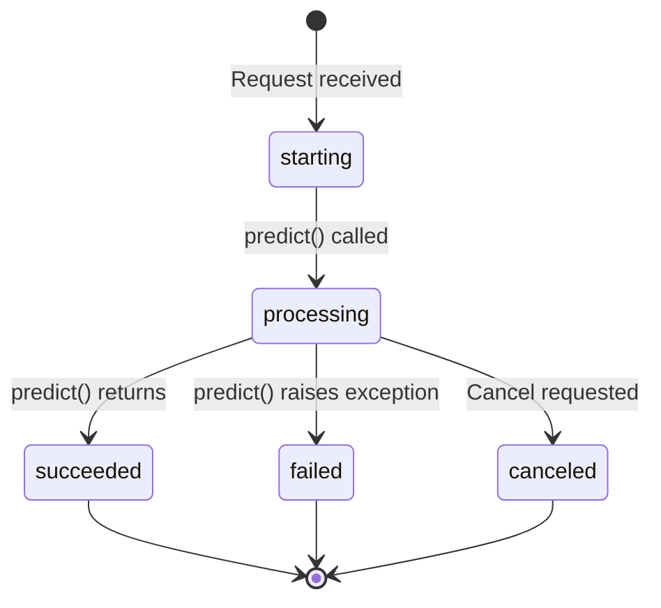
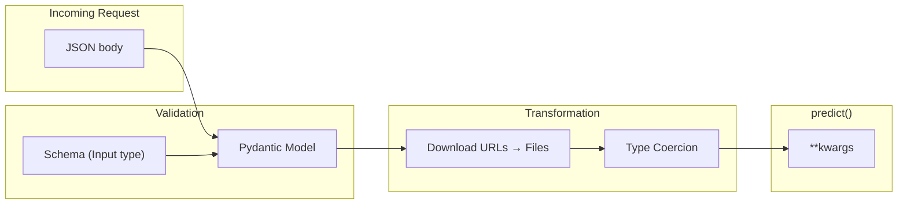
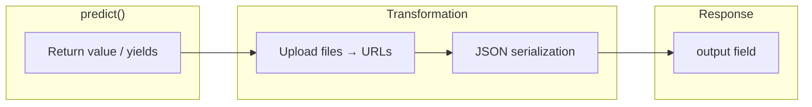
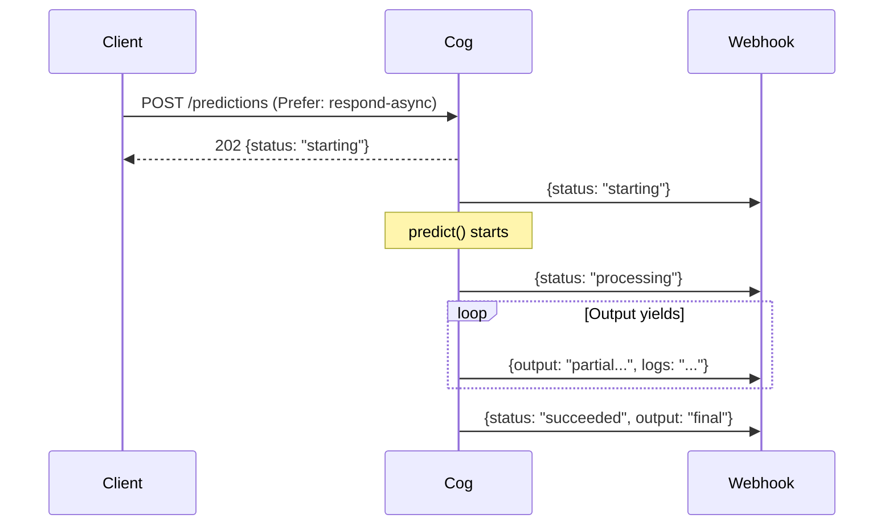

# Prediction API

The Prediction API is the HTTP interface for running model inference. It uses a fixed **envelope format** that wraps model-specific inputs and outputs, allowing a uniform API across all Cog models.

## Endpoints

| Endpoint | Method | Purpose |
|----------|--------|---------|
| `POST /predictions` | Create | Start a new prediction |
| `PUT /predictions/{id}` | Create (idempotent) | Start or retrieve existing prediction |
| `POST /predictions/{id}/cancel` | Cancel | Cancel a running prediction |
| `GET /health-check` | Health | Check server status |
| `GET /` | Index | List available endpoints |
| `GET /openapi.json` | Schema | OpenAPI specification |

By default, `POST /predictions` blocks until completion. For long-running predictions, use async mode with `Prefer: respond-async` header - the response returns immediately with status `processing`, and progress updates are delivered via webhook.

## The Envelope Pattern

Every Cog model exposes the same endpoints with the same request/response structure. The model-specific parts (input fields, output type) are defined by the [Schema](./02-schema.md) and validated at runtime.

```
┌────────────────────────────────────────────────────────┐
│  Fixed Envelope (same for all models)                  │
│  ┌──────────────────────────────────────────────────┐  │
│  │  id, status, created_at, logs, metrics, ...      │  │
│  └──────────────────────────────────────────────────┘  │
│  ┌──────────────────────────────────────────────────┐  │
│  │  input: { ... }    ← model-specific (from schema)│  │
│  └──────────────────────────────────────────────────┘  │
│  ┌──────────────────────────────────────────────────┐  │
│  │  output: ...       ← model-specific (from schema)│  │
│  └──────────────────────────────────────────────────┘  │
└────────────────────────────────────────────────────────┘
```

This pattern means:
- Clients use the same code to call any Cog model
- Platforms can route requests without understanding model internals
- Input validation is schema-driven, not hardcoded

## PredictionRequest

What clients send to start a prediction:

```json
{
  "id": "abc-123",
  "input": {
    "prompt": "A photo of a cat",
    "steps": 50
  },
  "webhook": "https://example.com/webhook",
  "webhook_events_filter": ["start", "output", "logs", "completed"]
}
```

| Field | Type | Purpose |
|-------|------|---------|
| `id` | string (optional) | Client-provided ID for idempotency |
| `input` | object | **Model-specific** - validated against schema |
| `webhook` | URL (optional) | Where to send progress updates |
| `webhook_events_filter` | array (optional) | Which events to send |
| `created_at` | datetime (optional) | Client-provided timestamp |

The `input` object is validated against the `Input` schema generated from the predictor's `predict()` signature. Unknown fields are rejected; missing required fields raise validation errors.

## PredictionResponse

What comes back from the API:

```json
{
  "id": "abc-123",
  "status": "succeeded",
  "input": {
    "prompt": "A photo of a cat",
    "steps": 50
  },
  "output": "https://storage.example.com/output.png",
  "logs": "Loading model...\nGenerating image...\nDone.",
  "error": null,
  "metrics": {
    "predict_time": 4.52
  },
  "created_at": "2024-01-15T10:30:00Z",
  "started_at": "2024-01-15T10:30:01Z",
  "completed_at": "2024-01-15T10:30:05Z"
}
```

| Field | Type | Purpose |
|-------|------|---------|
| `id` | string | Prediction identifier |
| `status` | enum | `starting`, `processing`, `succeeded`, `canceled`, `failed` |
| `input` | object | Echo of the input (for reference) |
| `output` | any | **Model-specific** - type defined by schema |
| `logs` | string | Captured stdout/stderr from predict() |
| `error` | string | Error message if status is `failed` |
| `metrics` | object | Timing and other metrics |
| `created_at` | datetime | When request was received |
| `started_at` | datetime | When prediction began |
| `completed_at` | datetime | When prediction finished |

## Status Lifecycle



## Dynamic Payload Handling

The magic of the envelope pattern is that the `input` and `output` fields are dynamically typed based on the schema.

### Input Validation Flow



1. **Parse JSON** - Extract `input` from request body
2. **Validate against schema** - Pydantic checks types, required fields, constraints
3. **Download files** - URLs in `cog.Path` fields are fetched to local temp files
4. **Coerce types** - Strings become Paths, etc.
5. **Call predict()** - Validated input passed as `**kwargs`

### Output Handling Flow



1. **Capture output** - Return value or yielded values from predict()
2. **Upload files** - `cog.Path` outputs are uploaded, replaced with URLs
3. **Serialize** - Convert to JSON-compatible format
4. **Return** - Place in `output` field of response

### File Handling

Input files (cog.Path):
```
Client sends:    {"input": {"image": "https://example.com/photo.jpg"}}
Server downloads: /tmp/inputabc123.jpg
predict() sees:  image = Path("/tmp/inputabc123.jpg")
```

Output files (cog.Path):
```
predict() returns: Path("/tmp/output.png")
Server uploads:    https://storage.example.com/output-xyz.png
Client receives:   {"output": "https://storage.example.com/output-xyz.png"}
```

## Webhooks

For async predictions, progress is delivered via webhooks:



### Webhook Events

| Event | When | Payload Contains |
|-------|------|------------------|
| `start` | Prediction begins | `status: starting` |
| `output` | Each yield from iterator | Partial `output` |
| `logs` | Log lines captured | Updated `logs` |
| `completed` | Prediction finishes | Final `status`, `output`, `metrics` |

Filter events with `webhook_events_filter`:
```json
{
  "input": {...},
  "webhook": "https://...",
  "webhook_events_filter": ["completed"]
}
```

## Streaming Output

For models that yield output progressively:

```python
def predict(self, prompt: str) -> Iterator[str]:
    for token in generate(prompt):
        yield token
```

The API can deliver these as:

1. **Webhooks** - Each yield triggers an `output` webhook
2. **Server-Sent Events** - Stream via `Accept: text/event-stream`
3. **Final array** - Sync response collects all yields into `output: ["a", "b", "c"]`

## Training API

The training API (`/trainings`) uses the same envelope pattern:

- `TrainingRequest` extends `PredictionRequest`
- `TrainingResponse` extends `PredictionResponse`
- Calls `train()` method instead of `predict()`

## Code References

| File | Purpose |
|------|---------|
| `python/cog/schema.py` | `PredictionRequest`, `PredictionResponse`, `Status` |
| `python/cog/server/http.py` | HTTP endpoints, request handling |
| `python/cog/server/runner.py` | Prediction orchestration |
| `python/cog/server/webhook.py` | Webhook delivery |
