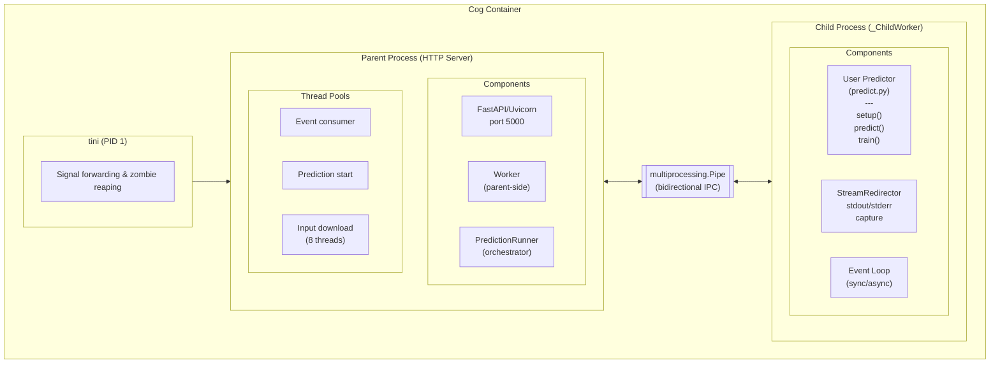
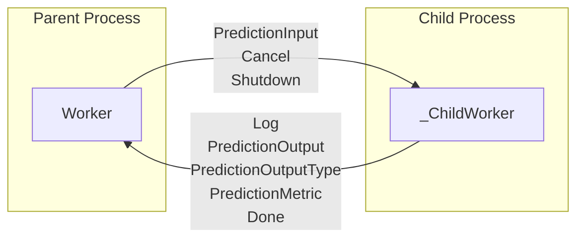
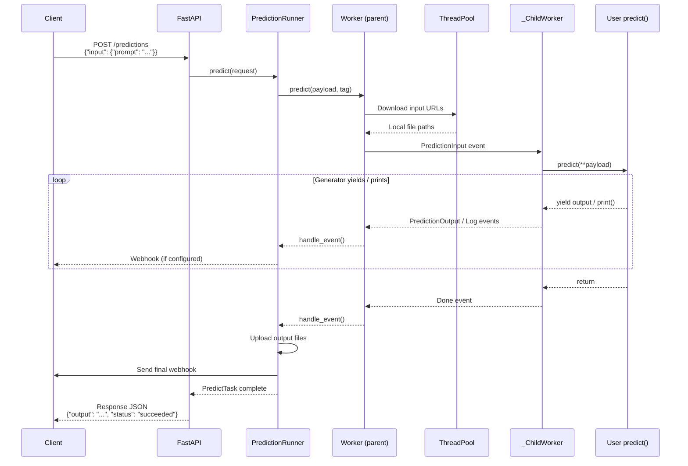
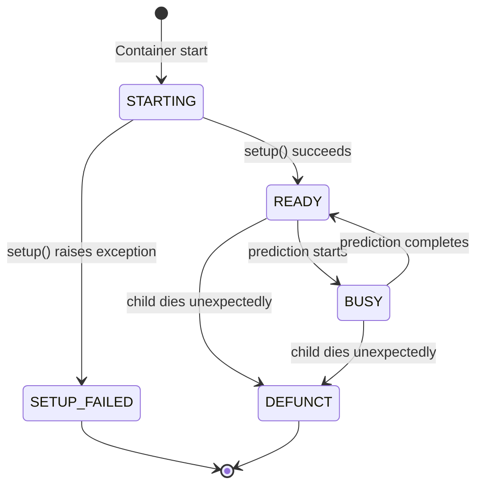
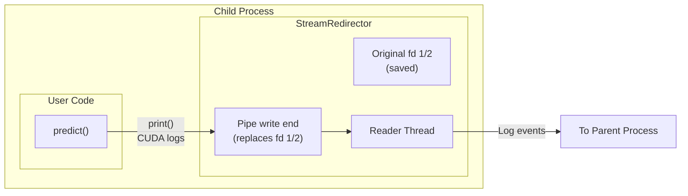

# Container Runtime

This document covers what happens when a Cog container runs. It's where the [Model Source](./01-model-source.md), [Schema](./02-schema.md), and [Prediction API](./03-prediction-api.md) come together.

## Overview

When a Cog container runs, it executes a **two-process architecture** with a minimal init system. The design isolates user model code from the HTTP server for stability, resource management, and clean shutdown handling.

## High-Level Architecture



## Process Roles

### tini (PID 1)
- **What**: Minimal init system (~30KB binary)
- **Why**: Proper signal forwarding to children, zombie process reaping
- **Entry**: `ENTRYPOINT ["/sbin/tini", "--"]`

### Parent Process (HTTP Server)
- **What**: Python process running FastAPI/Uvicorn
- **Entry**: `CMD ["python", "-m", "cog.server.http"]`
- **Responsibilities**:
  - HTTP API on port 5000
  - Request validation (Pydantic)
  - Input file downloading (from URLs)
  - Webhook delivery
  - Output file uploads
  - Health state management
  - Child process lifecycle

### Child Process (_ChildWorker)
- **What**: Isolated Python process for user code
- **Spawned via**: `multiprocessing.get_context("spawn").Process`
- **Responsibilities**:
  - Load user's predictor module
  - Run `setup()` once at startup
  - Execute `predict()` / `train()` methods
  - Capture stdout/stderr
  - Send events back to parent

## Why Two Processes?

1. **Isolation**: User code crashes don't bring down the HTTP server
2. **Memory**: Fresh address space for each model load (spawn vs fork)
3. **CUDA**: Clean GPU context initialization in child
4. **Cleanup**: Parent can restart child if it dies
5. **Monitoring**: Parent tracks child health independently

## Inter-Process Communication



Communication uses Python's `multiprocessing.Pipe()` with pickled `Envelope` objects:

```python
@define
class Envelope:
    event: Union[Cancel, PredictionInput, Shutdown, Log, ...]
    tag: Optional[str] = None  # Routes concurrent predictions
```

### Event Types

| Event | Direction | Purpose |
|-------|-----------|---------|
| `PredictionInput` | Parent → Child | Start prediction with input payload |
| `Cancel` | Parent → Child | Abort the current prediction |
| `Shutdown` | Parent → Child | Graceful termination signal |
| `PredictionOutputType` | Child → Parent | Declares the output type (once per prediction) |
| `PredictionOutput` | Child → Parent | Output value (multiple for generators) |
| `Log` | Child → Parent | Captured stdout/stderr line |
| `PredictionMetric` | Child → Parent | Timing/performance metrics |
| `Done` | Child → Parent | Prediction complete (success or failure) |

## Request Flow: Prediction Lifecycle



## Key Components Deep Dive

### HTTP Server (`http.py`)

| Endpoint | Method | Purpose |
|----------|--------|---------|
| `/` | GET | API index |
| `/health-check` | GET | Health status |
| `/predictions` | POST | New prediction |
| `/predictions/{id}` | PUT | Idempotent create |
| `/predictions/{id}/cancel` | POST | Cancel running |
| `/shutdown` | POST | Graceful shutdown |

### Health States



### StreamRedirector (Output Capture)

The child process captures stdout/stderr including native library output (CUDA, etc.):



## Concurrency Model

### Default: Sequential (`max_concurrency=1`)
- One prediction at a time
- Sync `def predict()` supported
- Cancellation via `SIGUSR1` signal

### Concurrent (`max_concurrency > 1`)
- Requires `async def predict()`
- Python 3.11+ for `asyncio.TaskGroup`
- Configure in `cog.yaml`:
  ```yaml
  concurrency:
    max: 5
  ```





```mermaid
gantt
    title max_concurrency=1 (Sequential)
    dateFormat X
    axisFormat %s
    section Predictions
    Prediction 1 :0, 3
    Prediction 2 :3, 6
    Prediction 3 :6, 9
```

```mermaid
gantt
    title max_concurrency=5 (Concurrent)
    dateFormat X
    axisFormat %s
    section Predictions
    Prediction 1 :0, 4
    Prediction 2 :1, 4
    Prediction 3 :2, 6
    Prediction 4 :0, 5
    Prediction 5 :3, 5
```

## Environment Variables

| Variable | Default | Purpose |
|----------|---------|---------|
| `PORT` | 5000 | HTTP server port |
| `COG_LOG_LEVEL` | INFO | Logging verbosity |
| `COG_MAX_CONCURRENCY` | 1 | Max concurrent predictions |
| `COG_THROTTLE_RESPONSE_INTERVAL` | 0.5s | Webhook rate limit |

## File Locations

| Path | Purpose |
|------|---------|
| `/var/run/cog/ready` | K8s readiness probe touch file |
| `/src` | User code (WORKDIR) |
| `/src/weights` | Common weights location |

## Code References

| File | Purpose |
|------|---------|
| `python/cog/server/http.py` | FastAPI app, endpoints |
| `python/cog/server/worker.py` | Worker, _ChildWorker |
| `python/cog/server/runner.py` | PredictionRunner |
| `python/cog/server/webhook.py` | Webhook delivery |
| `python/cog/server/stream_redirector.py` | Output capture |
