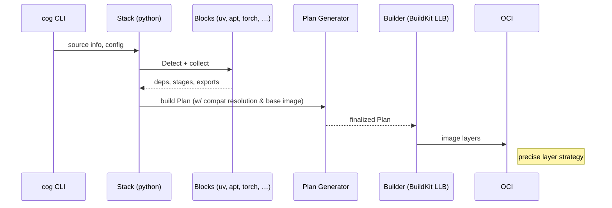

# Cogpack – Project Context & Working Checklist

> Last updated: <!-- YYYY-MM-DD will be filled in automatically by Cursor when saving -->

## 1. Mission
Package Cog models into OCI images using a **stack + blocks + plan + builder** architecture that gives us precise control over layers, reproducibility, and ergonomics.  
The system is internal-only for the foreseeable future but must be solid enough to replace the existing Cog build path.

## 2. Glossary (🆗 settled for now)
| Term | Definition |
|------|------------|
| **Stack** | Detects if it can handle the project and orchestrates an ordered list of Blocks. *Only one Stack wins per build.* |
| **Block** | A self-contained “lego brick” that may: Detect, emit dependency constraints, append build/export stages, etc. |
| **Plan** | The result of Stack + Blocks: a set of `Stage`s (≈ Dockerfile stages) with `Op`s (`Exec`, `Copy`, …) plus resolved dependencies. |
| **Builder** | Executes a Plan (target: BuildKit LLB). |
| **Cogpack Image** | The base image selected/resolved for the build (formerly “base image”). |

## 3. Guiding Principles
1. 📉 **Ruthless scope** – do what we need *now*, defer everything else with TODOs.
2. 🧩 **Modular** – Stacks & Blocks are loosely coupled; Plan vs. Builder decoupled.
3. 🛠 **Ease of hacking** – Internal engineers should grok & extend quickly.
4. 🧪 **Tests from day 1** – Unit per Block, snapshot plans, end-to-end builds.
5. 📜 **Docs live with code** – keep this file & package README up-to-date.

## 4. Current Focus
Produce a *fully functional Python stack* covering:
- ✅ CPU-only “hello-world” model (string-project fixture)
- ✅ GPU + PyTorch
- ✅ GPU + TensorFlow
- ✅ CPU + PyTorch
- ✅ CPU + TensorFlow

Success = images build & run via `cog predict`, under env-var flag.

## 5. High-Level Workflow

## 6. Open (⚠ deferred) Decisions
- Block mutability vs. append-only semantics.
- Ownership of `LayerID` & artifact naming.
- Secrets API surface.
- Compatibility-matrix location & version resolver implementation.
- Plan/schema versioning.
- Metrics/logging format.

## 7. Near-Term Checklist *(living – update as we work)*
- [ ] **Interfaces** – Extract `stack` & `block` interfaces into their own files.
- [ ] **Directory layout** – Decide on `pkg/cogpack/stacks` & `pkg/cogpack/blocks` or similar.
- [ ] **Python Stack scaffold** – minimal Detect; hard-code block order.
- [ ] **Core Blocks skeletons** – uv, apt, torch, tensorflow, cuda, cog-wheel, weights.
- [ ] **Dependency struct & resolver stub** – semver constraints, multi-pass solver.
- [ ] **Plan package** – move structs from `core` to `plan` (API still unstable).
- [ ] **BuildKit builder spike** – convert basic Plan to LLB, build CPU hello-world.
- [ ] **Unit tests** – for Stack detection and first Block.
- [ ] **README.md** – initial high-level doc inside `pkg/cogpack`.

## 8. Contributing / Editing This File
• Keep sections terse; add links to code where helpful.  
• Record *what* and *why*, not detailed code snippets.  
• Use task list above for coordinated work; mark ✅ when done.

---
<!-- End of context file -->
