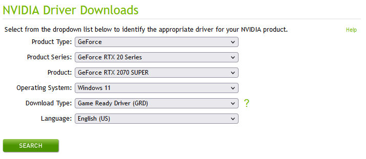
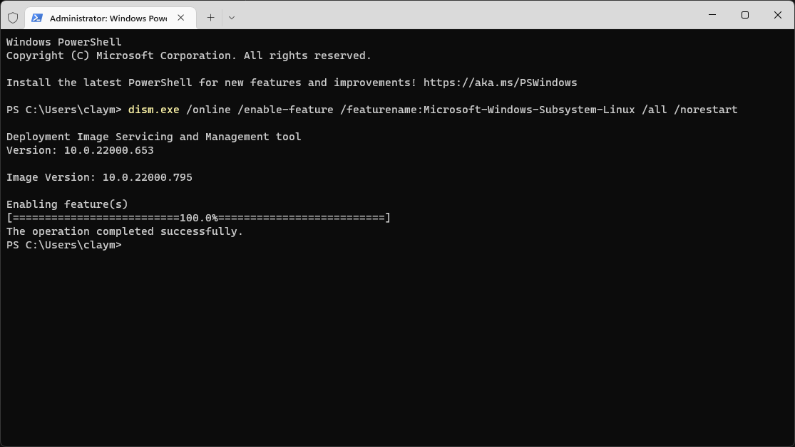
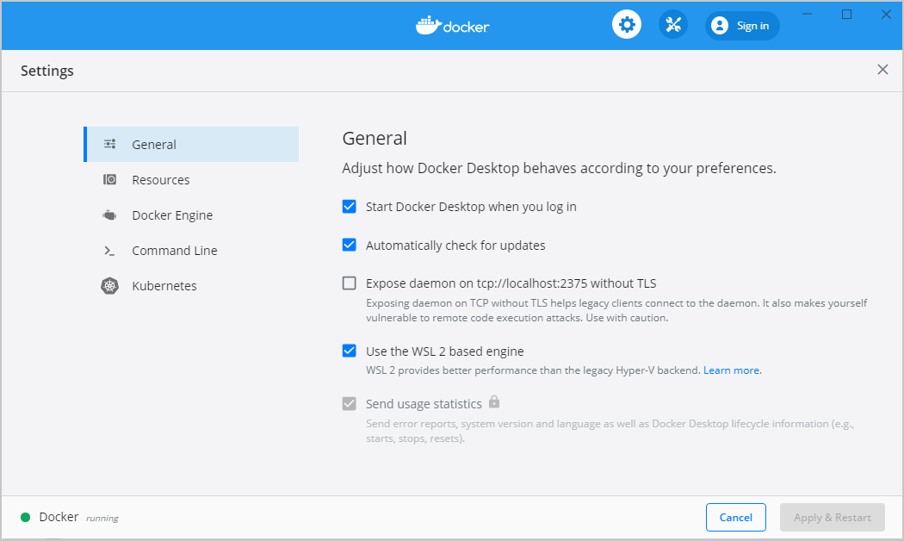
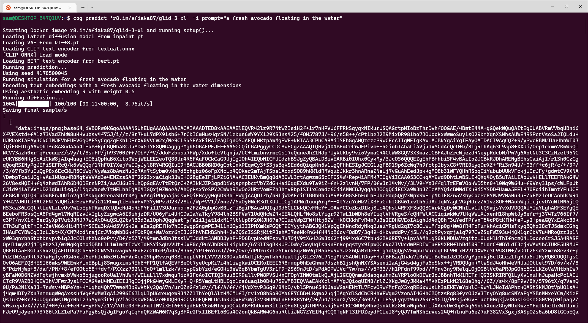
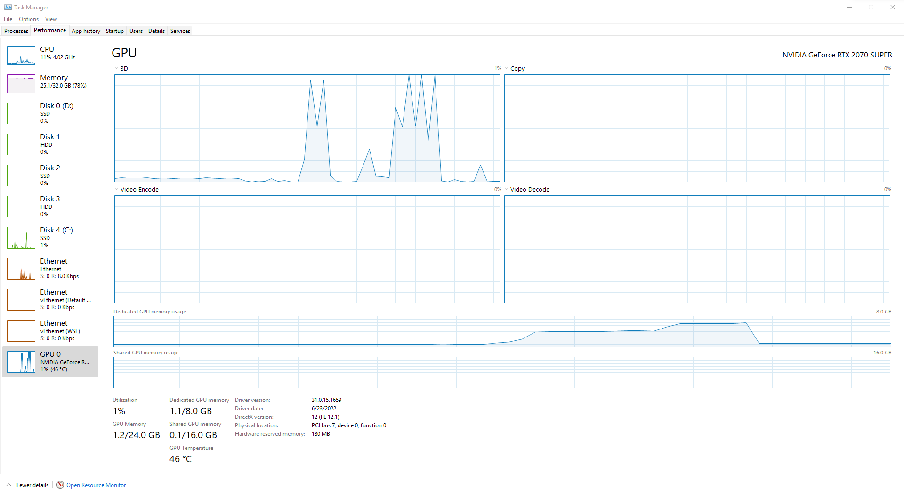

# How to set up Cog on Windows with WSL 2

This guide shows you how to install and run Cog on Windows 11 using WSL 2, with GPU passthrough for NVIDIA GPUs.

Windows 10 is not officially supported -- GPU passthrough requires an insider build.

## Prerequisites

- Windows 11
- An NVIDIA GPU (RTX 2000/3000 series, or Kepler/Tesla/Volta/Ampere series). Other configurations are not guaranteed to work.

## Install the NVIDIA GPU driver

Install the latest Game Ready drivers for your GPU from the [NVIDIA driver download page](https://www.nvidia.com/download/index.aspx).

Select your GPU model and download the driver:



Restart your computer after the driver finishes installing.

## Enable WSL 2 and virtualization

Open Windows Terminal as an administrator (search for "Terminal", right-click, and select "Run as administrator").

### Enable the Windows Subsystem for Linux

```powershell
dism.exe /online /enable-feature /featurename:Microsoft-Windows-Subsystem-Linux /all /norestart
```

If you see a permissions error, confirm you are running the terminal as administrator.

### Enable the Virtual Machine Platform

```powershell
dism.exe /online /enable-feature /featurename:VirtualMachinePlatform /all /norestart
```

If this fails, [enable virtualization in your BIOS/UEFI](https://docs.microsoft.com/en-us/windows/wsl/troubleshooting#error-0x80370102-the-virtual-machine-could-not-be-started-because-a-required-feature-is-not-installed).

A successful output reads `The operation completed successfully.`



### Reboot

Reboot your computer so that WSL 2 and virtualization are available.

## Update the WSL 2 Linux kernel

Download and run the [WSL2 Linux kernel update package for x64 machines](https://wslstorestorage.blob.core.windows.net/wslblob/wsl_update_x64.msi). Approve elevated permissions when prompted.

Verify the kernel version in an administrator terminal:

```powershell
wsl cat /proc/version
```

You should see at least `Linux version 5.10.43.3` or later.

If the kernel version is outdated, go to **Settings > Windows Update > Advanced options** and enable **Receive updates for other Microsoft products**, then check for updates.

## Configure WSL 2

Set WSL 2 as the default version:

```powershell
wsl --set-default-version 2
```

Install Ubuntu from the [Microsoft Store](https://www.microsoft.com/store/apps/9N9TNGVNDL3Q), then launch the "Ubuntu" app from the Start Menu. Create a Linux user account when prompted.

## Install the CUDA toolkit for WSL-Ubuntu

> **Important**: Do not install CUDA using generic Linux instructions. In WSL 2, always use the WSL-Ubuntu-specific CUDA toolkit package.

Enter your WSL 2 VM from PowerShell:

```powershell
wsl.exe
```

Install the CUDA toolkit (adjust the CUDA version if your GPU requires a different one):

```sh
sudo apt-key del 7fa2af80  # safe to ignore if this fails
wget https://developer.download.nvidia.com/compute/cuda/repos/wsl-ubuntu/x86_64/cuda-wsl-ubuntu.pin
sudo mv cuda-wsl-ubuntu.pin /etc/apt/preferences.d/cuda-repository-pin-600
wget https://developer.download.nvidia.com/compute/cuda/11.7.0/local_installers/cuda-repo-wsl-ubuntu-11-7-local_11.7.0-1_amd64.deb
sudo dpkg -i cuda-repo-wsl-ubuntu-11-7-local_11.7.0-1_amd64.deb
sudo cp /var/cuda-repo-wsl-ubuntu-11-7-local/cuda-B81839D3-keyring.gpg /usr/share/keyrings/
sudo apt-get update
sudo apt-get -y install cuda-toolkit-11-7
```

## Install Docker

Download and install [Docker Desktop for Windows](https://desktop.docker.com/win/main/amd64/Docker%20Desktop%20Installer.exe).

After installation, open Docker Desktop and go to **Settings > General**. Ensure **Use the WSL 2 based engine** is checked:



Click **Apply & Restart**, then reboot your computer.

## Install Cog

Open Windows Terminal and enter WSL 2:

```powershell
wsl.exe
```

Download and install Cog:

```bash
sudo curl -o /usr/local/bin/cog -L https://github.com/replicate/cog/releases/latest/download/cog_`uname -s`_`uname -m`
sudo chmod +x /usr/local/bin/cog
```

Verify the installation:

```bash
which cog        # should output /usr/local/bin/cog
cog --version    # should output the version number
```

## Test a prediction

Run a prediction to confirm everything works:

```bash
cog predict 'r8.im/afiaka87/glid-3-xl' -i prompt="a fresh avocado floating in the water" -o prediction.json
```



You can monitor GPU memory usage in Task Manager while the prediction runs:



If the model returns JSON output (e.g. base64-encoded images), you can extract and decode it with `jq`:

```bash
sudo apt install jq
jq -cs '.[0][0][0]' prediction.json | cut --delimiter "," --field 2 | base64 --ignore-garbage --decode > prediction.png
```

To open the result from WSL 2, use Windows binaries with the `.exe` extension:

```bash
explorer.exe prediction.png
```


## References

- [NVIDIA CUDA on WSL User Guide](https://docs.nvidia.com/cuda/wsl-user-guide/index.html)
- [NVIDIA CUDA Downloads for WSL-Ubuntu](https://developer.nvidia.com/cuda-downloads?target_os=Linux&target_arch=x86_64&Distribution=WSL-Ubuntu&target_version=2.0)
- [Docker WSL 2 GPU Support](https://www.docker.com/blog/wsl-2-gpu-support-for-docker-desktop-on-nvidia-gpus/)
- [WSL Linux Kernel Update](https://docs.microsoft.com/en-us/windows/wsl/install-manual#step-4---download-the-linux-kernel-update-package)
- [Cog on GitHub](https://github.com/replicate/cog)
