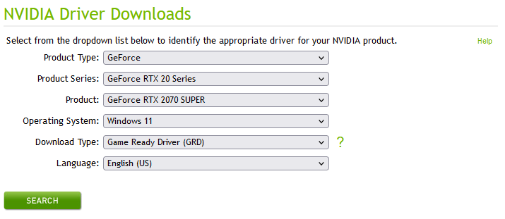
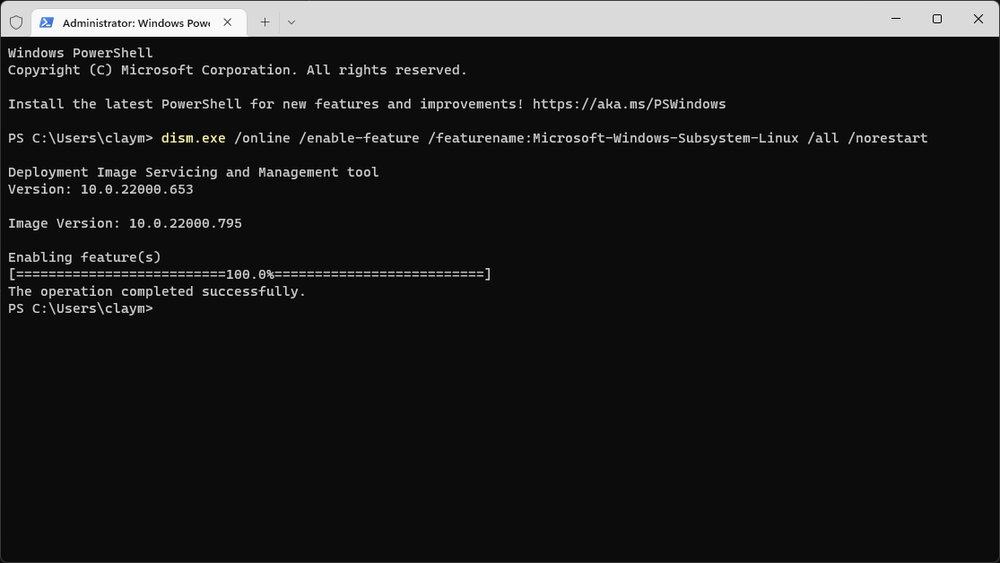
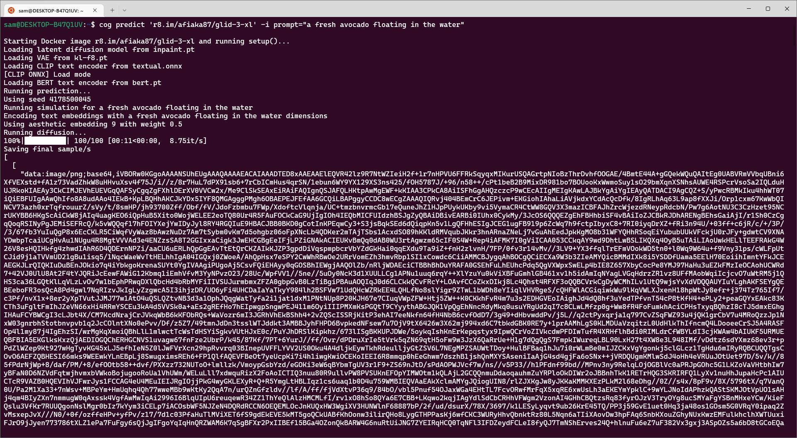
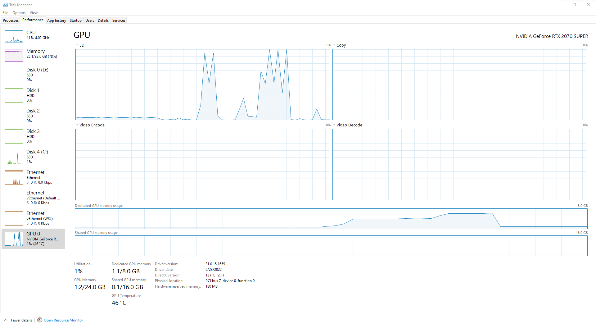

# Using `cog` on Windows 11 with WSL 2

- [0. Prerequisites](#0-prerequisites)
- [1. Install the GPU driver](#1-install-the-gpu-driver)
- [2. Unlocking features](#2-unlocking-features)
  - [2.1. Unlock WSL2](#21-unlock-wsl2)
  - [2.2. Unlock virtualization](#22-unlock-virtualization)
  - [2.3. Reboot](#23-reboot)
- [3. Update MS Linux kernel](#3-update-ms-linux-kernel)
- [4. Configure WSL 2](#4-configure-wsl-2)
- [5. Configure CUDA WSL-Ubuntu Toolkit](#5-configure-cuda-wsl-ubuntu-toolkit)
- [6. Install Docker](#6-install-docker)
- [7. Install `cog` and pull an image](#7-install-cog-and-pull-an-image)
- [8. Run a model in WSL 2](#8-run-a-model-in-wsl-2)
- [9. References](#9-references)

Running cog on Windows is now possible thanks to WSL 2. Follow this guide to enable WSL 2 and GPU passthrough on Windows 11.

**Windows 10 is not officially supported, as you need to be on an insider build in order to use GPU passthrough.**

## 0. Prerequisites

Before beginning installation, make sure you have:

- Windows 11.
- NVIDIA GPU.
  - RTX 2000/3000 series
  - Kesler/Tesla/Volta/Ampere series
  - Other configurations are not guaranteed to work.

## 1. Install the GPU driver

Per NVIDIA, the first order of business is to install the latest Game Ready drivers for you NVIDIA GPU.

<https://www.nvidia.com/download/index.aspx>

I have an NVIDIA RTX 2070 Super, so filled out the form as such:



Click "search", and follow the dialogue to download and install the driver.

Restart your computer once the driver has finished installation.

## 2. Unlocking features

Open Windows Terminal as an administrator.

- Use start to search for "Terminal"
- Right click -> Run as administrator...

Run the following powershell command to enable the Windows Subsystem for Linux and Virtual Machine Platform capabilities.

### 2.1. Unlock WSL2

```powershell
dism.exe /online /enable-feature /featurename:Microsoft-Windows-Subsystem-Linux /all /norestart
```

If you see an error about permissions, make sure the terminal you are using is run as an administrator and that you have an account with administrator-level privileges.

### 2.2. Unlock virtualization

```powershell
dism.exe /online /enable-feature /featurename:VirtualMachinePlatform /all /norestart
```

If this command fails, make sure to [enable virtualization capabilities](https://docs.microsoft.com/en-us/windows/wsl/troubleshooting#error-0x80370102-the-virtual-machine-could-not-be-started-because-a-required-feature-is-not-installed) in your computer's BIOS/UEFI. A successful output will print `The operation completed successfully.`



### 2.3. Reboot

Before moving forward, make sure you reboot your computer so that Windows 11 will have WSL2 and virtualization available to it.

## 3. Update MS Linux kernel

Download and run the [WSL2 Linux kernel update package for x64 machines](https://wslstorestorage.blob.core.windows.net/wslblob/wsl_update_x64.msi) msi installer. When prompted for elevated permissions, click 'yes' to approve the installation.

To ensure you are using the correct WSL kernel, `open Windows Terminal as an adminstrator` and enter:

```powershell
wsl cat /proc/version
```

This will return a complicated string such as:

```sh
Linux version 5.10.102.1-microsoft-standard-WSL2 (oe-user@oe-host) (x86_64-msft-linux-gcc (GCC) 9.3.0, GNU ld (GNU Binutils) 2.34.0.20200220)
```

The version we are interested in is `Linux version 5.10.102.1`. At this point, you should have updated your kernel to be at least `Linux version 5.10.43.3`.

If you can't get the correct kernel version to show:

Open `Settings` → `Windows Update` → `Advanced options` and ensure `Receive updates for other Microsoft products` is enabled. Then go to `Windows Update` again and click `Check for updates`.

## 4. Configure WSL 2

First, configure Windows to use the virtualization-based version of WSL (version 2) by default. In a Windows Terminal with adminstrator priveleges, type the following:

```powershell
wsl --set-default-version 2
```

Now, you will need to go to the Microsoft Store and [Download Ubuntu 18.04](https://www.microsoft.com/store/apps/9N9TNGVNDL3Q)


Launch the "Ubuntu" app available in your Start Menu. Linux will require its own user account and password, which you will need to enter now:


## 5. Configure CUDA WSL-Ubuntu Toolkit

By default, a shimmed version of the CUDA tooling is provided by your Windows GPU drivers.

Important: you should _never_ use instructions for installing CUDA-toolkit in a generic linux fashion. in WSL 2, you _always_ want to use the provided `CUDA Toolkit using WSL-Ubuntu Package`.

First, open PowerShell or Windows Command Prompt in administrator mode
by right-clicking and selecting "Run as administrator".
Then enter the following command:

```powershell
wsl.exe
```

This should drop you into your running linux VM. Now you can run the following bash commands to install the correct version of cuda-toolkit for WSL-Ubuntu. Note that the version of CUDA used below may not be the version of CUDA your GPU supports.

```sh
sudo apt-key del 7fa2af80 # if this line fails, you may remove it.
wget https://developer.download.nvidia.com/compute/cuda/repos/wsl-ubuntu/x86_64/cuda-wsl-ubuntu.pin
sudo mv cuda-wsl-ubuntu.pin /etc/apt/preferences.d/cuda-repository-pin-600
wget https://developer.download.nvidia.com/compute/cuda/11.7.0/local_installers/cuda-repo-wsl-ubuntu-11-7-local_11.7.0-1_amd64.deb
sudo dpkg -i cuda-repo-wsl-ubuntu-11-7-local_11.7.0-1_amd64.deb
sudo apt-get update
sudo apt-get -y install cuda-toolkit-11-7
```

## 6. Install Docker

Download and install [Docker Desktop for Windows](https://desktop.docker.com/win/main/amd64/Docker%20Desktop%20Installer.exe). It has WSL 2 support built in by default.

Once installed, run `Docker Desktop`, you can ignore the first-run tutorial. Go to **Settings → General** and ensure **Use the WSL 2 based engine** has a checkmark next to it. Click **Apply & Restart**.


Reboot your computer one more time.

## 7. Install `cog` and pull an image

Open Windows Terminal and enter your WSL 2 VM:

```powershell
wsl.exe
```

Download and install `cog` inside the VM:

```bash
sudo curl -o /usr/local/bin/cog -L https://github.com/replicate/cog/releases/latest/download/cog_`uname -s`_`uname -m`
sudo chmod +x /usr/local/bin/cog
```

Make sure it's available by typing:

```bash
which cog # should output /usr/local/bin/cog
cog --version # should output the cog version number.
```

## 8. Run a model in WSL 2

Finally, make sure it works. Let's try running `afiaka87/glid-3-xl` locally:

```bash
cog predict 'r8.im/afiaka87/glid-3-xl' -i prompt="a fresh avocado floating in the water" -o prediction.json
```



While your prediction is running, you can use `Task Manager` to keep an eye on GPU memory consumption:



This model just barely manages to fit under 8 GB of VRAM.

Notice that output is returned as JSON for this model as it has a complex return type. You will want to convert the base64 string in the json array to an image.

`jq` can help with this:

```sh
sudo apt install jq
```

The following bash uses `jq` to grab the first element in our prediction array and converts it from a base64 string to a `png` file.

```bash
jq -cs '.[0][0][0]' prediction.json | cut --delimiter "," --field 2 | base64 --ignore-garbage --decode > prediction.png
```

When using WSL 2, you can access Windows binaries with the `.exe` extension. This lets you open photos easily within linux.

```bash
explorer.exe prediction.png
```


## 9. References

- <https://docs.nvidia.com/cuda/wsl-user-guide/index.html>
- <https://developer.nvidia.com/cuda-downloads?target_os=Linux&target_arch=x86_64&Distribution=WSL-Ubuntu&target_version=2.0>
- <https://www.docker.com/blog/wsl-2-gpu-support-for-docker-desktop-on-nvidia-gpus/>
- <https://docs.microsoft.com/en-us/windows/wsl/install-manual#step-4---download-the-linux-kernel-update-package>
- <https://github.com/replicate/cog>
